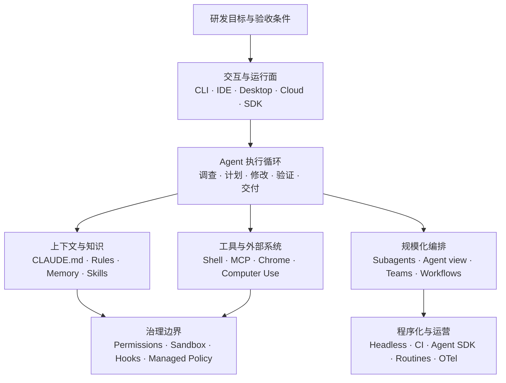

# Claude Code 研发 Agent 技术白皮书

> 从个人工程闭环到多 Agent 编排、自动化与企业治理

> 信息基线：2026-08-10  
> 文档版本：v1.0  
> 文档类型：技术白皮书  
> 证据范围：Anthropic 官方 Claude Code / Claude Platform 文档；涉及 Vercel Workflow 的段落会明确标为外部扩展。  
> 适合读者：希望系统掌握 Claude Code 配置、能力边界、多 Agent、高级自动化与企业治理的研发工程师。

---

## 执行摘要

Claude Code 不是“终端里的代码聊天机器人”。它是一套可在 CLI、IDE、Desktop、Cloud、CI 和 Agent SDK 中运行的研发 Agent 系统：

> 收集上下文 → 选择工具 → 执行动作 → 读取结果 → 更新计划 → 继续，直到通过验收或需要人工决策

真正值得投入的不是把所有开关都打开，而是做对五个选择：

1. 什么必须常驻 `CLAUDE.md`，什么应按需进入 Skill；
2. 什么只需 Permission，什么还必须由 Sandbox 隔离；
3. 单 Session、Subagent、Agent view、Agent team、Dynamic workflow 分别何时使用；
4. 本地、Cloud、Remote Control 和 SDK 的运行边界是什么；
5. 什么时候 Claude Code 已经够用，什么时候才需要外部 durable workflow。

### 核心结论与能力选型

| 你的问题 | 首选能力 | 原因 |
|---|---|---|
| 当前仓库实现、调试、测试 | CLI / IDE | 距离代码、Shell 和编辑器最近 |
| 多个完整任务由你并行监督 | Desktop / Agent view | 每条任务保持独立 Session |
| 大量日志或代码调查，不污染主上下文 | Subagent | 独立上下文，最后只回传结论 |
| 成员需要互相讨论、质疑和协调 | Agent team | 独立 Session + 共享任务 + 点对点消息 |
| 数十到数百个同类工作项 | Dynamic workflow | 编排写成可读、可重跑的脚本 |
| 不占本机的异步研发任务 | Claude Code on the web | 在隔离 Cloud VM 中继续运行 |
| 在手机或网页继续控制本机任务 | Remote Control | 运行仍发生在原来的电脑 |
| 可复用研发流程 | Skill | 按需加载方法、脚本和模板 |
| 外部系统与实时数据 | MCP / Connector | 提供结构化工具与资源 |
| 生命周期上的强制检查 | Hook | 确定性执行，可阻断动作或完成 |
| CI 中一次性调用 | `claude -p` | 非交互、可输出 JSON / stream-json |
| 自建垂直 Agent 产品 | Claude Agent SDK | 复用 Claude Code 的 Agent loop |

### 阅读导航

- **日常研发**：读第 1～4 章，再看 Slash 命令附录。
- **团队落地**：读第 3～6 章，重点关注配置、安全、Skill、Hook、MCP。
- **平台与规模化**：读第 5～9 章，再读命令全集与官方索引。

### 正文目录

1. 能力架构与运行边界
2. 日常研发与证据闭环
3. Session 与上下文
4. 配置与安全
5. 扩展体系
6. 多 Agent 编排
7. 模型、Plan 与 Review
8. 自动化与 Agent SDK
9. 定时、事件驱动与企业治理
10. 高级场景决策
11. 采用成熟度模型
12. 附录：Slash 命令全集与官方资料索引

---

## 研究范围、方法与限制

本白皮书采用“官方能力事实 + 工程决策分析”的方法：

- 只把 Anthropic 第一方文档明确描述的能力视为 Claude Code 能力；
- 将稳定能力、实验 / Research preview、账户或 Provider 限定能力分开表达；
- 将产品功能、工程建议和外部工作流扩展明确区分；
- 不做缺乏同条件实测的模型质量、速度或价格排名；
- Slash 命令按 Built-in、Bundled Skill、Bundled Workflow、Alias 和动态入口分别统计。

本文是 2026-08-10 的能力快照。Claude Code 的版本、Surface、Provider、账户计划、组织策略和 Feature flag 都会改变实际可用集合；运行时事实应以 `/help`、`/status`、`/skills` 及当前官方文档为准。

---

## 1. 能力架构与运行边界

Claude Code 可以被理解为七层研发执行系统：



这套架构的核心不是某一个模型，而是：知识怎样进入、动作怎样受限、工作怎样拆分、结果怎样验证。

### 1.1 运行界面如何选

| 界面 | 最适合 | 核心优势 | 主要边界 |
|---|---|---|---|
| CLI | 本地开发、Shell 工作流、深度配置 | 命令与会话控制最完整 | 多任务可视监督较弱 |
| VS Code | 当前选区、Inline diff、计划审阅 | 编辑器上下文直接 | 复杂后台任务仍需单独监督 |
| JetBrains | IntelliJ 系列工程 | 保留 JetBrains 工程语义 | 部分体验更接近 CLI 集成 |
| Desktop | 多 Session、预览、终端、diff 反馈 | worktree、Side chat、Computer Use、PR/CI 监督 | 能力会受平台和版本影响 |
| Claude Code on the web | 异步 Cloud 任务、并行 PR | 新鲜 VM，关闭浏览器后仍可运行 | 不会自动拥有本机未提交内容与私有工具 |
| Mobile / Remote Control | 离开电脑后继续监督本机任务 | 本机文件、凭证和 MCP 仍可用 | 本机进程和网络必须保持可用 |
| `claude -p` / SDK | CI、服务和自建 Agent | 可机器化调用与结构化输出 | 需要自己设计运行与安全边界 |

### 1.2 Cloud 和 Remote Control 不能混为一谈

- **Cloud Session** 在 Anthropic 管理的 VM 中运行，仓库由云环境克隆；
- **Remote Control** 只是从其他设备控制仍在本机运行的 Claude Code；
- Cloud 自然能获得的是已提交的项目指令、Skill、Agent、Hook、`.mcp.json` 等；
- 用户级 `~/.claude`、本机 Auto memory、未提交文件和私人工具不会自动迁移。

复杂任务可以先在本地 Plan，再把必要计划和配置提交给 Cloud。需要回到本机继续时，可在满足仓库、分支和工作区条件的前提下使用 teleport。

### 1.3 Desktop 什么时候比 CLI 更好

当你需要以下任意两项时，Desktop 通常更自然：并行 Session、自动 worktree、集成终端、编辑器与预览、diff 行级反馈、Side chat、Computer Use、CI/PR 状态监督、计划任务。

Side chat 能读取主 Session 的上下文，但不会把临时问答写回主对话，适合追问设计理由和解释局部改动。

官方参考：

- [Platforms](https://code.claude.com/docs/en/platforms)、[Desktop](https://code.claude.com/docs/en/desktop)、[Claude Code on the web](https://code.claude.com/docs/en/claude-code-on-the-web)
- [Remote Control](https://code.claude.com/docs/en/remote-control)、[VS Code](https://code.claude.com/docs/en/vs-code)、[JetBrains](https://code.claude.com/docs/en/jetbrains)

---

## 2. 日常研发：让 Agent 围绕证据闭环

### 2.1 一份高质量任务应该包含什么

```text
目标：修复订单取消后偶发重复退款。
范围：只改 payment-service；公共事件协议保持兼容。
调查：先追踪取消事件、幂等键和退款落库路径。
验收：运行指定单测与集成测试，并补回归测试。
边界：不连接生产、不推送、不创建外部工单。
交付：说明根因、证据、修改点、风险与未验证项。
```

目标和验收决定“什么叫完成”；范围与自主边界决定“可以怎样完成”。

### 2.2 推荐执行节奏

1. 先调查入口、调用链、状态变化和已有测试；
2. 高影响或陌生任务先进入 Plan mode；
3. 一次只验证一个关键假设；
4. 修改后运行 formatter、build、test、lint；
5. 使用 diff / review 检查变化；
6. 把“已运行验证、静态推断、仍未知”分开交付。

### 2.3 工具选择顺序

| 需求 | 首选 | 为什么 |
|---|---|---|
| 仓库读写、搜索与 Git | 内置文件 / 搜索 / Shell 工具 | 最窄、最容易审计 |
| 外部 API 与实时数据 | MCP / Connector | 结构化、可重复 |
| 浏览器应用 | Chrome 集成 | 比全桌面控制范围更窄 |
| 没有 API、CLI 或浏览器入口的 GUI | Computer Use | 能力最广，也最需要限制 |

推荐优先级是：**内置结构化工具 → 受限 Shell → MCP → Chrome → Computer Use**。

Computer Use 应按 Session 审批具体应用。终端、IDE、Finder 和系统设置近似系统级能力，不应为了“方便”全部预授权。

官方参考：

- [How Claude Code works](https://code.claude.com/docs/en/how-claude-code-works)、[Best practices](https://code.claude.com/docs/en/best-practices)、[Common workflows](https://code.claude.com/docs/en/common-workflows)
- [Tools reference](https://code.claude.com/docs/en/tools-reference)、[Computer Use](https://code.claude.com/docs/en/computer-use)

---

## 3. Session 与上下文：长任务的关键不是无限堆内容

### 3.1 Resume、Fork、Rewind 各解决什么

| 能力 | 用途 | 不适合 |
|---|---|---|
| Resume | 继续原来的工作线 | 同时探索互斥方案 |
| Fork | 从同一上下文建立另一条方案 | 撤销外部系统副作用 |
| Checkpoint / Rewind | 快速恢复 Claude 编辑前的代码或对话 | 替代 Git、数据库事务或部署回滚 |

Checkpoint 主要跟踪 Write/Edit/NotebookEdit 等编辑工具造成的变化。Shell、外部程序、数据库、部署和其他并发 Session 的修改不应假设能被完整恢复。

重大重构的正确保险仍然是 Git 提交点；需要保留两个方案时优先 fork 或 worktree。

### 3.2 Context 与 Compact

文件、工具输出、Skill、MCP 描述和对话都会占用 Context。接近上限时会自动 compact，也可手动 `/compact`。

控制上下文噪声的四种办法：

- 大量调查放进 Subagent，只让主 Session 收结论；
- 稳定规则放进版本化指令，不靠聊天历史维持；
- 大规模中间结果放在 Dynamic workflow 变量或外部存储；
- 每个阶段留下短、可验证的结论和下一步。

Prompt caching 可以降低稳定前缀的重复延迟与成本，但它不是正确性机制。频繁切换模型、改变工具或重写长指令会降低缓存复用；关键规则仍应通过测试、Permission 和 Hook 落地。

### 3.3 `CLAUDE.md`、Rules、Auto memory 和 Skill 的分工

| 载体 | 适合放什么 | 加载方式 |
|---|---|---|
| `CLAUDE.md` | 每次都应遵守的仓库规则 | 按目录层次进入上下文 |
| `.claude/rules/*.md` | 按主题或路径生效的规则 | 可用 `paths:` 限定范围 |
| Auto memory | 本机、跨 Session 的经验和偏好 | 索引常驻，详细主题按需读取 |
| Skill | 可复用方法、脚本、模板和参考 | 根据描述自动匹配或显式调用 |

#### `CLAUDE.md` 的四个层次

| Scope | 常见位置 | 用途 |
|---|---|---|
| Managed | 系统策略路径或 managed settings | 企业强制规范 |
| User | `~/.claude/CLAUDE.md` | 个人跨项目偏好 |
| Project | `./CLAUDE.md` 或 `./.claude/CLAUDE.md` | 团队共享的构建、架构和验收规则 |
| Local | `./CLAUDE.local.md` | 当前机器的个人项目偏好，不应提交 |

好的 Project `CLAUDE.md` 只写“模型难以从代码稳定推断，但每次工作都必须遵守”的内容：标准命令、模块责任、关键不变量、安全闸门、兼容性和完成条件。

已有 `AGENTS.md` 的仓库，可以在 `CLAUDE.md` 中用 `@AGENTS.md` 导入，再追加 Claude 专属规则，避免维护两份重复规范。

#### Auto memory 的边界

Auto memory 默认按 Git 仓库保存在 `~/.claude/projects/<project>/memory/`。同一仓库的 worktree 共享它，但它不会自动跨机器或进入 Cloud。`MEMORY.md` 是索引，详细主题文件按需加载。

适合记：隐蔽构建条件、调试结论、常见陷阱和个人习惯。必须经团队评审的规范应进入 `CLAUDE.md`、Rule、测试或 Hook。

#### 如何确认真的加载了

- `/context`：看当前上下文中的指令、Skill 和占用；
- `/memory`：查看 `CLAUDE.md` 与 Auto memory；
- `/status`：确认 Settings sources；
- `/doctor` 或 `claude doctor`：检查安装和配置；
- `InstructionsLoaded` Hook：记录指令何时、因何路径加载。

官方参考：

- [Sessions](https://code.claude.com/docs/en/sessions)、[Context window](https://code.claude.com/docs/en/context-window)、[Checkpointing](https://code.claude.com/docs/en/checkpointing)
- [Memory](https://code.claude.com/docs/en/memory)、[Large codebases](https://code.claude.com/docs/en/large-codebases)、[Skills](https://code.claude.com/docs/en/skills)

---

## 4. 配置与安全：规则、权限和隔离必须分层

### 4.1 Settings 优先级

当前官方模型可概括为：

1. Managed settings；
2. CLI 参数和 `--settings`；
3. 项目本地 `.claude/settings.local.json`；
4. 项目共享 `.claude/settings.json`；
5. 用户 `~/.claude/settings.json`。

标量通常由高优先级覆盖；部分权限与沙箱数组会跨 Scope 合并。安全规则具有 deny-first 特征：其他 Scope 的 allow 不能抵消 deny。

#### 配置控制面

| 配置域 | 主要载体 | 负责什么 |
|---|---|---|
| 模型与推理 | Settings、环境变量、CLI、`/model`、`/effort` | 默认模型、可选模型、Effort、Fallback 与 Fast mode |
| 权限 | `permissions`、Managed policy、`/permissions` | Tool 的 Allow / Ask / Deny 与默认模式 |
| Shell 隔离 | Sandbox Settings、`/sandbox`、容器 / VM | 文件、网络和子进程边界 |
| 项目知识 | `CLAUDE.md`、Rules、Auto memory | 常驻规则、路径规则和本机经验 |
| 可复用流程 | Skills、旧 Commands、Workflows | 按需方法、脚本模板和多 Agent 编排 |
| 外部能力 | `.mcp.json`、Managed MCP、Connectors、Channels | Tool、Resource、OAuth、实时事件入口 |
| 生命周期控制 | Hooks | Tool、Permission、Compact、Task、Worktree 等事件 |
| 分发与代码智能 | Plugins、Marketplaces、LSP、Monitors | 版本化交付扩展组件 |
| 认证与 Provider | Login、环境变量、Bedrock / Google / Foundry 配置 | 凭证、模型路径、区域和 Provider 能力差异 |
| 企业与观测 | Managed / Server-managed Settings、OTel | 强制策略、遥测、审计与成本 |

不要根据“文件存在”推断生效。修改后用 `/status` 查看来源，用 `claude doctor` 排查 JSON 和字段问题。

### 4.2 六种 Permission mode 怎么选

| Mode | 行为 | 推荐场景 |
|---|---|---|
| `default` | 读取通常无需询问，其他动作按规则处理 | 陌生仓库、敏感任务、日常基线 |
| `acceptEdits` | 自动接受编辑和常见文件操作 | 会认真复核 diff 的本地实现 |
| `plan` | 只读调查和计划 | 架构、审计、高影响改动前 |
| `auto` | 后台分类器判断动作 | 可信方向下的长任务；仍非安全证明 |
| `dontAsk` | 只执行明确预批准工具，其他需询问动作会拒绝 | 无人交互 CI |
| `bypassPermissions` | 基本跳过权限询问 | 仅可丢弃、无敏感凭证的隔离容器/VM |

`acceptEdits` 不等于允许任意 Shell、MCP 或部署；`dontAsk` 也不是自动放行。对“绝不能发生”的动作使用 deny 或 Managed policy，不要只在聊天中提醒。

### 4.3 Permission 和 Sandbox 管不同问题

| 层次 | 回答的问题 |
|---|---|
| Permission | Claude 是否应该尝试这个 Tool 调用 |
| Sandbox | Bash 及子进程在 OS 层实际上能访问什么 |
| Hook / Managed policy | 某类事件是否必须被检查、修改或阻断 |

Sandbox 主要约束 Bash 与子进程。MCP、Web、Chrome 和 GUI 仍需各自治理。无人值守 Agent 应优先使用短生命周期容器或 VM、短期凭证和最小网络出口。

首次进入未知仓库时，Workspace trust 是真实安全边界。项目 Settings、Hook、MCP 和脚本都可能执行代码；README、Issue、网页和工具输出也应被视为潜在提示注入输入。不要让“读取未知内容”和“拥有发布或生产权限”发生在同一默认信任层。

### 4.4 一份可落地的项目权限思路

```json
{
  "permissions": {
    "defaultMode": "default",
    "allow": [
      "Bash(git diff *)",
      "Bash(npm test *)",
      "Bash(npm run lint *)"
    ],
    "ask": [
      "Bash(git push *)"
    ],
    "deny": [
      "Read(./.env)",
      "Read(./secrets/**)"
    ]
  }
}
```

这是设计示例，不是通用模板。命令匹配、复合 Shell、重定向和路径规则必须按当前官方语义实测。

官方参考：

- [Settings](https://code.claude.com/docs/en/settings)、[Permission modes](https://code.claude.com/docs/en/permission-modes)、[Permissions](https://code.claude.com/docs/en/permissions)
- [Sandboxing](https://code.claude.com/docs/en/sandboxing)、[Security](https://code.claude.com/docs/en/security)、[Server-managed settings](https://code.claude.com/docs/en/server-managed-settings)

---

## 5. 扩展体系：一个选择表看懂 Skill、Hook、MCP 与 Plugin

| 需求 | 首选机制 | 判断标准 |
|---|---|---|
| 每个 Session 都要知道的稳定规则 | `CLAUDE.md` / Rule | 小、稳定、与目录或路径绑定 |
| 可复用知识、清单和多步流程 | Skill | 仅相关时加载，可自动或显式调用 |
| 独立上下文中的专业工作 | Subagent | 需要隔离噪声、工具、模型或权限 |
| 外部 API、服务和实时数据 | MCP | 提供 Tool、Resource 或 Prompt |
| 某事件每次都必须执行 | Hook | 确定性、生命周期绑定、可阻断 |
| 给团队版本化分发整套能力 | Plugin | 打包 Skill、Agent、Hook、MCP、LSP 等 |

### 5.1 Skill 与自定义 Command

Skill 是含 `SKILL.md` 的目录，可附带脚本、参考、模板和样例。Claude 先看元数据，仅在相关时读取正文与资源。

旧 `.claude/commands/*.md` 仍兼容，但自定义 Command 已统一到 Skill 体系；新能力优先放在 `.claude/skills/<name>/SKILL.md`。Skill 可以限制工具、设置 effort，也可用 `context: fork` 在隔离 Agent 中执行。

值得沉淀成 Skill 的场景：发布检查、数据库变更审查、事故取证、内部 CLI、PR 总结、规范化文档和评测流程。

### 5.2 Hook：确定性的质量闸门

Hook 可以挂在 Session、Prompt、Tool、Permission、Compact、Subagent、Team task、Worktree 和配置变化等事件上。高价值用法包括：

- 编辑后自动 formatter；
- 完成任务前运行测试；
- 拦截危险命令和受保护目录；
- 审批时查询内部策略；
- SessionStart 注入动态环境；
- TaskCompleted 仅在验收通过时允许完成；
- 将事件发送到审计系统。

Hook 应短小、幂等、超时有界，并明确失败时放行还是阻断。长时间业务编排不应塞进 Hook。

### 5.3 MCP、Connector 与 Channel

MCP 用于接入外部工具与实时数据。Claude Code 支持本地 stdio 和远程 HTTP；新服务应优先当前推荐的传输方式。Project MCP 放在 `.mcp.json`，应经过显式信任。

Channel 能让 MCP Server 把 CI、监控或聊天事件主动推入正在运行的 Session。它是高影响入口：必须限制发送者、可触发工具和权限转发，并保留审计。

推荐组合：MCP 连接数据库，Skill 规定查询与分析方法，Hook 审计敏感查询；Channel 推送告警，但生产修改仍需人工审批。

### 5.4 Plugin、Marketplace、LSP 与 Monitor

Plugin 是版本化分发单元，可以包含 Skill、Agent、Hook、MCP、LSP、后台 Monitor、可执行文件和主题。项目内能力先在 `.claude/` 验证，稳定后再打包 Plugin，能显著降低维护成本。

官方参考：[Skills](https://code.claude.com/docs/en/skills)、[Hooks](https://code.claude.com/docs/en/hooks)、[MCP](https://code.claude.com/docs/en/mcp)、[Channels](https://code.claude.com/docs/en/channels)、[Plugins](https://code.claude.com/docs/en/plugins)。

---

## 6. 多 Agent：四种并行机制不要混用

| 机制 | 谁协调 | Worker 能否互聊 | 最适合 | 不适合 |
|---|---|---|---|---|
| Subagent | 当前主 Session | 否，主要向调用者汇报 | 少量调查、专业角色、隔离噪声 | 多成员持续协作 |
| Agent view | 用户 | 各 Session 独立 | 人同时监督多个完整后台任务 | 自动团队协作 |
| Agent team | Lead + 共享任务列表 | 可以 | 竞争假设、跨角色协同、互相质疑 | 严格顺序、小任务、同文件高冲突 |
| Dynamic workflow | JavaScript 编排脚本 | 由脚本组织 | 数十到数百工作项、可重跑扇出 | 运行中频繁人工对话 |

### 6.1 Subagent：隔离上下文，而不只是并行

Subagent 可控制 tools、模型、permission mode、turn 数、Skill、MCP、Hook、Memory、后台运行、effort 和 worktree 隔离。

它的核心价值是把大量日志、文件和网页调查留在独立上下文，主 Session 只拿到结论。后台 Subagent 无法停下来等待交互审批：原本需要询问的动作会被拒绝，所以权限必须提前收敛，或改为前台执行。

### 6.2 Agent view：人管理多条完整 Session

适合你同时让 Claude 修 Bug、审 PR、调查日志，并由你决定何时介入。它不是 Agent team；Session 默认不共享任务列表和结论。**截至本文基线，Agent view 仍是 Research preview**，界面和快捷键可能变化。

### 6.3 Agent team：只有真实协作需求才值得使用

Team 包含 Lead、独立 Teammate 和共享 Task list。成员可以互发消息、领取未阻塞任务，也可先提交 Plan 由 Lead 审批。

**截至本文基线，Agent teams 是默认关闭的实验能力**，需要显式启用对应实验开关；不应直接作为组织级稳定流程的唯一依赖。

最适合：

- 多个竞争假设需要相互挑战；
- 前端、后端、测试需要持续协调；
- 研究或 Review 中成员要交叉验证。

不要用在严格顺序任务、同一核心文件或强依赖小步骤。Team 也不自动提供 worktree 隔离；文件所有权必须明确。

### 6.4 Dynamic workflow：把编排写成可读脚本

Dynamic workflow 会生成 JavaScript 编排脚本，由独立 runtime 执行循环、分支、pipeline 和中间结果。脚本可查看、保存并重跑，也可随 Plugin 分发。

高价值场景：

- 数百文件迁移；
- 每个路由独立安全检查，再由 verifier 交叉验证；
- 多来源研究、投票和证据过滤；
- 检查 → 修复 → 再检查，直到通过或停止进展；
- 每个变更文件独立 Review，再去重排序。

它的价值是规模化和可重放，不是“多开几个聊天”。生成后仍要审查输入范围、并发、停止条件、权限和令牌成本。

### 6.5 Worktree：并行写入的基础设施

Worktree 隔离 Git 文件状态，但不会隔离数据库、端口、云资源和共享缓存。每个 Worker 仍需独立外部资源命名空间。

官方参考：[Subagents](https://code.claude.com/docs/en/sub-agents)、[Agent view](https://code.claude.com/docs/en/agent-view)、[Agent teams](https://code.claude.com/docs/en/agent-teams)、[Dynamic workflows](https://code.claude.com/docs/en/workflows)、[Worktrees](https://code.claude.com/docs/en/worktrees)。

---

## 7. 模型、Plan、Advisor 与 Review：把高成本能力用在决策点

### 7.1 Model 与 Effort

Effort 不是固定智力等级；同名档位在不同模型上的含义和成本可能不同。日常任务使用默认或中等档，架构、安全、复杂调试和大型 Agent 任务再提高。Fast mode 截至本文基线仍是 Research preview。

适合混合模型的任务通常是“设计难、实现机械”：Plan 阶段用更强推理，执行阶段切换到更高效模型。Fast mode 适合高频人机迭代，不一定适合无人值守批处理。

### 7.2 Plan 与 Advisor

| 能力 | 最适合 | 不值得用的情况 |
|---|---|---|
| Plan mode | 高影响改动、陌生仓库、先调查后实施 | 一行明确小修复 |
| Advisor | 少数关键决策、重复失败、完成前复核 | 每一步都需要最强模型时 |

Advisor 会让当前 Agent 在关键点咨询第二个模型，并额外消费上下文。可用 Provider、模型和功能状态应按当前官方文档确认。

### 7.3 三种 Review 深度

| 能力 | 运行位置 | 最适合 |
|---|---|---|
| 本地 Review / Desktop review | 当前 Session | 迭代中的快速反馈 |
| Ultrareview | 云端多 Agent | 重大 Diff 合并前的独立验证；Research preview |
| 托管 Code Review | GitHub PR | 团队持续 PR 审查与 Inline comment |

Review 不替代测试、静态分析和业务判断。认证、权限、支付、密钥、解析器等安全关键代码，还应结合 Claude Security / security-guidance、威胁模型和人工安全审查。

### 7.4 Artifact、Preview 与可视化交付

Claude Code 可以将结果制作或发布为可交互 Artifact，也可在 Desktop Preview 中验证本地应用。Artifact 适合 Demo、可视化报告和内部工具原型；Preview 更适合不发布内容的本地调试。

发布前应单独检查仓库片段、日志、客户数据、凭证和 Connector 数据是否会进入共享链接。可视化交付提高沟通效率，但不会替代代码、测试和可复现构建产物。

官方参考：

- [Model configuration](https://code.claude.com/docs/en/model-config)、[Fast mode](https://code.claude.com/docs/en/fast-mode)、[Advisor](https://code.claude.com/docs/en/advisor)
- [Code Review](https://code.claude.com/docs/en/code-review)、[Ultrareview](https://code.claude.com/docs/en/ultrareview)、[Claude Security](https://code.claude.com/docs/en/claude-security)、[Artifacts](https://code.claude.com/docs/en/artifacts)

---

## 8. 自动化与 SDK：从命令行走向研发平台

### 8.1 `claude -p`：最短的非交互路径

`claude -p` 可以读取 stdin，输出 text、JSON 或 stream-json，并可用 JSON Schema 约束最终结果；还能继续 Session、限制工具、预算和回合。

适合：Diff 审查、日志归因、批量文档、CI 结构化检查。生产脚本应固定工作目录、Permission mode、工具 allow/deny、预算、超时和输出 Schema。

非交互环境没人回答审批，优先使用 `dontAsk` + 明确 allowlist，而不是 `bypassPermissions`。

### 8.2 GitHub Actions 与 GitLab CI/CD

适合 PR Review、Issue triage、自动修复和维护任务。安全基线：

- 只从可信事件触发；
- 使用最小权限 Token；
- 不把未信任 PR 内容与写权限放进同一 Job；
- 自动产出 PR，不直接合并；
- 部署和外部副作用保留环境保护与人工审批。

### 8.3 Claude Agent SDK：复用完整 Agent loop

Agent SDK 不是一次 Messages API 调用。它可控制 Session、流式输入输出、built-in tools、自定义或远程 MCP、权限回调、Hook、Subagent、Skill、Plugin、结构化输出、Checkpoint、预算、外部 Session storage 和 OpenTelemetry。

适合：内部修复平台、垂直研发 Agent、评测系统、多租户 Agent 服务。

它不会替你解决基础设施：生产环境仍需持久工作目录、进程生命周期、资源限制、网络策略、短期凭证、Session storage、租户隔离和可观测性。会执行代码的 Agent 应放在容器或更强隔离中。

官方参考：

- [Headless mode](https://code.claude.com/docs/en/headless)、[CLI reference](https://code.claude.com/docs/en/cli-reference)、[GitHub Actions](https://code.claude.com/docs/en/github-actions)
- [GitLab CI/CD](https://code.claude.com/docs/en/gitlab-ci-cd)、[Agent SDK](https://code.claude.com/docs/en/agent-sdk/overview)、[Secure deployment](https://code.claude.com/docs/en/agent-sdk/secure-deployment)

---

## 9. 定时、事件驱动与企业治理

### 9.1 三类后台能力

| 能力 | 生命周期 | 适合 |
|---|---|---|
| 当前 Session 的 `/loop` / Scheduled task | 进程存活期间 | 临时轮询、等待测试、一次提醒 |
| Desktop scheduled tasks | Desktop 本地环境 | 个人周期检查 |
| Cloud Routines | Anthropic 管理环境，新建 Session | Schedule、API、GitHub 事件驱动的异步维护；Research preview |

高价值例子：每日依赖审计、PR 失败自动归因、发布摘要、告警触发只读调查。低价值例子：高频扫描全仓，却没有稳定验收和结果消费方。

### 9.2 什么时候才需要外部 Durable Workflow

Claude Code 已有 Routines、Dynamic workflows、SDK Session storage 和后台 Agent，能覆盖多数研发流程。

只有当系统必须在自有基础设施上跨进程恢复、长时间等待人工批准、逐步骤重试，并协调多个非 Claude 系统时，再让外部工作流引擎持有状态：

```text
外部事件
  → Durable Workflow
  → 创建容器 / Sandbox / worktree
  → 调用 Claude Agent SDK
  → 保存 Session 与结构化结果
  → 等待审批或外部事件
  → 恢复 Workflow 与 Agent Session
  → 验证、PR、审计
```

Vercel 当前官方方案可用于这类外部持久编排；它不是 Claude Code 原生能力，也不应替代一个简单 Dynamic workflow 或 Cloud Routine。参考：[WorkflowAgent](https://vercel.com/kb/guide/what-is-workflowagent)、[Durable execution](https://vercel.com/blog/a-new-programming-model-for-durable-execution)。

### 9.3 企业落地必须管理什么

Provider 选择本身是架构决策。Claude Code 可通过 Anthropic 直接连接，也可使用受支持的第三方云平台与企业网关；不同路径在模型、Web / Cloud、Advisor、Fast mode、审计和计费上并非完全等价。需要计算环境自控时，还要评估 Self-hosted execution、容器隔离、出口控制和 Session 指标，而不是只替换 API Endpoint。

- 登录组织、Provider、模型和执行环境；
- Permission、Sandbox、Hook、MCP 与 Plugin 来源；
- Cloud、Remote Control、Agent view 等能力开关；
- 凭证发放、轮换、撤销和网络出口；
- Session、工具、权限、成本和错误事件的审计；
- 数据政策、ZDR 与 Cloud 功能之间的取舍。

OpenTelemetry 和 Analytics 能帮助发现采用率、成本异常和工具失败，但不能直接证明生产力或代码质量。账单与数据政策应以对应 Provider 和组织合同为准。

官方参考：

- [Scheduled tasks](https://code.claude.com/docs/en/scheduled-tasks)、[Routines](https://code.claude.com/docs/en/routines)、[Admin setup](https://code.claude.com/docs/en/admin-setup)
- [Feature availability](https://code.claude.com/docs/en/feature-availability)、[Third-party integrations](https://code.claude.com/docs/en/third-party-integrations)、[Monitoring](https://code.claude.com/docs/en/monitoring-usage)
- [Data usage](https://code.claude.com/docs/en/data-usage)、[ZDR](https://code.claude.com/docs/en/zero-data-retention)

---

## 10. 高级场景：推荐组合与不推荐做法

### 场景 A：大型跨层功能

**推荐组合**：主 Session 用 Plan 明确接口和验收 → Subagent 分别追前端、后端、测试影响 → 确认边界后用独立 worktree 实现 → 主 Session 集成。

只有各角色真的需要持续讨论时，才升级为 Agent team。

### 场景 B：竞争假设调试

**推荐组合**：每个 Team member 验证一个独立假设并互相质疑 → Lead 只接受有复现或代码证据的结论 → TaskCompleted Hook 要求回归测试。

这里的点对点消息比普通 Subagent 的单向汇报更有价值。

### 场景 C：500 文件迁移

**推荐组合**：先完成一个代表样本 → 将变换规则和验收写成 Skill → Dynamic workflow 发现文件、分片变换、批量验证和二次处理 → 输出结构化失败清单。

不要让主 Session 直接承载数百个中间结果。

### 场景 D：重大 PR 合并前建立信心

**推荐组合**：本地 Review 清理迭代问题 → 测试和静态检查 → 重要 PR 再使用 Ultrareview / 托管 Code Review → 安全关键代码叠加专项安全审查。

多 Agent Review 仍不是测试或形式化证明。

### 场景 E：事故响应助手

**推荐组合**：Channel/MCP 推送告警 → 只读 Permission + Sandbox → Subagent 分别建时间线、追调用链、检查最近变更 → 主 Session 输出“已证实 / 推断 / 未知”。

生产修复、回滚和外部消息必须保留人工批准。

### 场景 F：研发自动化平台

**推荐组合**：一次脚本先用 `claude -p` → 需要 Session、Hook、审批、结构化输出与自定义 Tool 时进入 Agent SDK → 每次运行容器隔离 → 外部持久化 Session → OTel 记录工具和权限事件。

---

## 11. 采用成熟度模型

组织不应从“全自动、多 Agent、全工具权限”起步。更稳妥的路径是逐级提升自主性，并让每一级都产生可验证资产。

### Level 1：单 Session 可验证闭环

- 掌握目标、范围、验收和权限边界的任务写法；
- 会用 Plan、resume、fork、compact 和 rewind；
- 在真实仓库维护一份短 `CLAUDE.md`。

### Level 2：配置与流程资产化

- 按路径拆 Rules；
- 做一个项目 Skill；
- 写一个格式化 Hook 和一个完成前测试 Hook；
- 接一个只读 MCP；
- 用 `/context`、`/status`、`/doctor` 验证加载。

### Level 3：隔离并行与规模化

- 用 Subagent 隔离调查；
- 用 worktree 隔离并行写入；
- 对比 Agent view、Agent team 和 Dynamic workflow；
- 给每个 Worker 明确输入、所有权、验收和停止条件。

### Level 4：自动化与平台治理

- 先做一个 `claude -p` 的结构化 CI 任务；
- 再用 Agent SDK 建可恢复 Session；
- 最后补齐容器、凭证、审计、限额和人工接管。

---

## 附录 A：Claude Code 全部官方 Slash 命令

<!-- CLAUDE_SLASH_COMMANDS_START -->

> 基线：Anthropic 官方 [Commands complete reference](https://code.claude.com/docs/en/commands.md)，核对日期 2026-08-10。  
> 统计口径：官方表共 106 行；剔除 3 个已移除命令并补入 20 个未单列的活跃别名后，当前共有 **99 个有效命令身份、24 个别名、123 种固定 Slash 拼写**。  
> 实现类型：**85 个 Built-in + 13 个 Bundled Skill + 1 个 Bundled Workflow**。动态 Skill、Plugin、MCP Prompt 和保存的 Workflow 另行说明，不存在全球固定总数。

### A.1 场景索引：先知道该查哪一组

| 场景 | 首选命令 | 关键区别 |
|---|---|---|
| 初次进入仓库 | `/init`、`/memory`、`/permissions` | 再按需配置 `/mcp` 与 `/plugin` |
| 大改前调查 | `/plan`、`/advisor` | `/advisor` 是实验性第二模型咨询，不替代计划 |
| 上下文治理 | `/context`、`/compact`、`/clear` | Compact 保留摘要，Clear 开新上下文 |
| 会话分支与恢复 | `/resume`、`/branch`、`/rewind` | Branch 切到新方向，Rewind 可能回退代码 |
| 并行工作 | `/subtask`、`/fork`、`/background`、`/workflows` | 分别是回传主会话、后台复制、整个会话脱离、脚本化编排 |
| 交付前检查 | `/diff`、`/code-review`、`/security-review`、`/verify` | Review、专项安全审查和真实运行验证职责不同 |
| 模型与成本 | `/model`、`/effort`、`/usage` | `/fast` 与 `/advisor` 可能产生额外成本或受 Provider 限制 |
| 远程与 Cloud | `/remote-control`、`/teleport`、`/schedule` | 本机远控、Cloud 拉回、Cloud Routine 是三种不同语义 |
| 扩展管理 | `/skills`、`/plugin`、`/mcp` | 变更后按需 reload，并审查供应链风险 |

### A.2 Built-in Commands：85 个

| 命令 | 作用 | 关键参数、条件或副作用 |
|---|---|---|
| `/add-dir <path>` | 为当前会话增加可访问目录 | 主要授予文件访问；不会普遍加载该目录全部 `.claude/` 配置 |
| `/advisor [model\|off]` | 启停第二模型顾问 | 实验性；Provider 受限；每次咨询额外耗用 Token |
| `/agents` | 显示创建和管理 Subagent 的说明 | 新版不再打开旧交互管理器 |
| `/autocompact [auto\|<tokens>]` | 设置自动 Compact 触发窗口 | 可给 Token 阈值；保存到用户配置 |
| `/autofix-pr [prompt]` | 启动 Cloud Agent 监控当前 PR 并处理 CI/评审反馈 | 需要 `gh` 与 Web 权限；可能推送代码 |
| `/background [prompt]` | 将当前会话转为后台 Agent | 可附最后一条提示；别名 `/bg` |
| `/branch [name]` | 从当前节点分支出新会话并切换 | 原会话保留；与后台复制 `/fork` 不同 |
| `/btw [question]` | 发起不进入主会话历史的侧问 | 关键事实不要只留在 Side question 中 |
| `/bug [report]` | 报告 Bug 或分享会话 | 会要求确认历史范围；别名 `/share` |
| `/cd <path>` | 将当前会话迁移到新工作目录 | 会加载新目录指令、迁移 Session，并可能要求 Trust |
| `/chrome` | 配置 Claude in Chrome | 需要 Chrome 扩展与受支持的 Anthropic 账户/连接 |
| `/clear [name]` | 清空 Context 并开始新会话 | 旧会话仍可恢复；别名 `/reset`、`/new` |
| `/color [color\|default]` | 设置当前会话提示条颜色 | 视觉标识，不改变模型行为 |
| `/compact [instructions]` | 汇总历史并释放 Context | 可指定摘要重点；关键事实可能被概括 |
| `/config [key=value ...]` | 打开设置或直接修改设置项 | 直接形式会持久写配置；别名 `/settings` |
| `/context [all]` | 可视化 Context 占用并给出优化建议 | `all` 展开完整明细 |
| `/copy [N]` | 复制最近或第 N 近的 Assistant 回复 | 有代码块时可选择；`w` 可写文件 |
| `/design-login` | 授权 Claude Design，供 `/design-sync` 使用 | 涉及浏览器账户授权 |
| `/desktop` | 在 Claude Code Desktop 中继续当前会话 | 平台、订阅受限；别名 `/app` |
| `/diff` | 交互查看未提交 Diff 和逐 Turn Diff | 只读查看，不自动提交 |
| `/effort [level\|auto]` | 调整模型推理强度 | 可选档位依模型；高档位增加成本 |
| `/exit` | 退出 CLI | 附着后台会话时只 Detach；别名 `/quit` |
| `/export [filename]` | 导出当前会话为纯文本 | 可能含代码和敏感上下文，分享前审查 |
| `/fast [on\|off]` | 开关快速模式 | Research preview；模型、账户和 Provider 受限；费率可能更高 |
| `/feedback [report]` | 发送 Claude Code 产品反馈 | 会要求确认历史范围 |
| `/focus` | 切换专注视图，只显示关键消息 | 仅 Fullscreen renderer；不删除历史 |
| `/fork [prompt]` | 复制当前对话为独立后台会话 | 主会话继续；并行写入通常还需 worktree |
| `/goal [condition\|clear]` | 设置跨 Turn 持续工作的完成条件 | 条件应可验证，并限制成本与副作用 |
| `/heapdump` | 生成 JS Heap snapshot 与诊断 | 不在菜单中；Snapshot 含完整会话和凭证，禁止分享 |
| `/help` | 显示当前可用帮助与命令 | 实际列表受版本、Surface、Provider、策略和扩展影响 |
| `/hooks` | 查看 Hook 配置 | 注意项目、用户和企业多层来源 |
| `/ide` | 管理 IDE 集成并查看状态 | 功能取决于 IDE 和连接状态 |
| `/import [codex\|gemini] [--dry-run] [--yes]` | 导入 Codex 或 Gemini CLI 配置 | 可导入指令、MCP、Command、Subagent、Skill；建议先 Dry run |
| `/init` | 为项目生成初始 `CLAUDE.md` | 会写项目文件 |
| `/insights` | 基于历史 Session 生成使用分析 | 会分析项目和交互历史，注意隐私 |
| `/install-github-app` | 为仓库安装 Claude GitHub App | 会改变外部 GitHub 集成与 Secret 配置 |
| `/install-slack-app` | 安装 Claude Slack App | 会打开 OAuth 并授权 Workspace |
| `/keybindings` | 打开键盘快捷键配置 | 保存后改变输入行为 |
| `/list-agents` | 列出可跨会话通信的 Agent / Session | 版本、平台和 Feature flag 受限；别名 `/peers` |
| `/login` | 登录 Anthropic 账户 | 认证来源会影响可用 Plan、Provider 和命令 |
| `/logout` | 登出 Anthropic 账户 | 清除会话凭据 |
| `/mcp [reconnect <server>\|enable\|disable ...]` | 管理 MCP 连接与 OAuth | 不可信 Server 可能带来执行和数据风险 |
| `/memory` | 编辑 `CLAUDE.md`、Auto memory 与条目 | 会影响后续 Session 的长期上下文 |
| `/mobile` | 显示 Claude 手机 App 下载二维码 | 别名 `/ios`、`/android`；不等于 Remote Control |
| `/model [model]` | 切换模型并可保存默认值 | 切模会重读历史并失去 Prompt cache |
| `/passes` | 分享一周 Claude Code 免费体验 | 仅符合资格的账户可见 |
| `/permissions` | 管理 Tool 的 Allow / Ask / Deny 与工作目录 | 放宽规则会扩大自动执行能力；别名 `/allowed-tools` |
| `/plan [description]` | 进入 Plan mode 并可立即描述任务 | 先分析，后编辑 |
| `/plugin [subcommand]` | 安装、启停和管理 Plugin | Plugin 可带 Skill、Agent、Hook、MCP；只信任明确来源 |
| `/powerup` | 打开 Claude Code 功能短课 | 教学入口，不代表所有能力都可用 |
| `/privacy-settings` | 查看与更新隐私设置 | 仅部分订阅计划可见 |
| `/radio` | 打开 Claude FM Lo-fi 音乐 | 某些第三方 Provider 不可用 |
| `/recap` | 生成当前 Session 的一行摘要 | 用于快速回忆现场 |
| `/release-notes` | 交互查看 Changelog | 用于核对版本行为变化 |
| `/reload-plugins [--force]` | 热重载启用的 Plugin | `--force` 可能破坏 Prompt cache；会加载新代码与工具 |
| `/reload-skills` | 重新扫描 Skill 和旧 Command 目录 | 报告新增与移除数量 |
| `/remote-control` | 允许从 Claude.ai 或移动端继续当前本地会话 | 运行仍在本机；别名 `/rc` |
| `/remote-env` | 选择 Cloud Agent 默认运行环境 | 环境决定网络、变量和凭证范围 |
| `/rename [name]` | 重命名当前 Session | 无参数时可从历史生成名称 |
| `/resume [session]` | 恢复指定 Session 或打开选择器 | 运行中的后台 Session 要从 Agent view Attach；别名 `/continue` |
| `/rewind` | 回退对话、代码或从某点摘要 | 可能修改工作区；别名 `/checkpoint`、`/undo` |
| `/sandbox` | 切换 Sandbox mode | 仅支持的平台；改变 Shell 文件和网络隔离边界 |
| `/schedule [description]` | 创建、更新、列出或运行 Cloud Routine | Research preview；订阅与 Web 权限受限；别名 `/routines` |
| `/scroll-speed` | 调节鼠标滚轮速度 | 仅 Fullscreen renderer，且部分 IDE 终端不支持 |
| `/security-review` | 对当前分支 Diff 做安全审查 | 需要 `origin`；审查结果不是安全证明 |
| `/setup-bedrock` | 交互配置 Amazon Bedrock | 仅对应环境变量启用时可见 |
| `/setup-vertex` | 交互配置 Google Cloud Agent Platform | 仅对应环境变量启用时可见 |
| `/skills` | 列出 Skill 并管理菜单/模型可见性 | 列表是动态的，修改会影响可调用范围 |
| `/status` | 显示版本、模型、账户、连接和 Session kind | 用于确认环境事实 |
| `/statusline` | 配置底部状态栏 | 可能写入脚本；注意性能和敏感信息 |
| `/stickers` | 订购 Claude Code 贴纸 | 外部流程，可能收集寄送信息 |
| `/stop` | 停止当前后台会话 | 仅 Attach 到后台 Session 时可用；保留 Transcript 与 worktree |
| `/subtask <task>` | 启动继承完整对话的后台 Subagent | 结果回到本会话；受 Agent view 可用性影响 |
| `/tasks` | 查看和管理当前 Session 的后台任务 | 可停止任务；别名 `/bashes` |
| `/team-onboarding` | 根据近 30 天历史生成团队上手指南 | 会分析使用历史，分享前检查私密信息 |
| `/teleport` | 将 Claude Code on the web Session 拉回本地 | 需要订阅；会拉取分支；别名 `/tp` |
| `/terminal-setup` | 配置 Shift+Enter 等终端键位 | 仅需要额外设置的终端显示 |
| `/theme` | 选择内置、无障碍或 Plugin 主题 | 视觉设置，不改变模型行为 |
| `/tui [default\|fullscreen]` | 切换 TUI Renderer 并保留 Session 重启 | Fullscreen 才支持 `/focus`、`/scroll-speed` |
| `/upgrade` | 打开升级页面 | Enterprise 不显示；涉及订阅变更 |
| `/usage` | 显示 Session 成本、额度和活动统计 | 别名 `/cost`、`/stats` |
| `/usage-credits` | 配置 Usage credits 或向管理员申请 | 可能启用超额计费；旧名 `/extra-usage` |
| `/voice [hold\|tap\|off]` | 开关语音听写并选择录音方式 | 需要 Claude.ai 账户和麦克风权限 |
| `/web-setup` | 用本机 `gh` 凭据连接 Claude Code on the web | 会建立外部账户连接 |
| `/workflows` | 查看、暂停、恢复和保存 Dynamic workflow | 保存后会动态新增 Slash 命令；注意 Agent 数和成本 |

### A.3 Bundled Skills：13 个

这些是 Anthropic 随 Claude Code 分发的 Prompt-based Skill，不是 CLI 固定逻辑。它们可被配置关闭，部分还可被同名企业、用户或项目 Skill 覆盖。

| 命令 | 作用 | 关键参数、条件或副作用 |
|---|---|---|
| `/batch <instruction>` | 将大规模修改拆为 5～30 个单元并行实现 | Git 仓库；会创建后台 Agent、worktree 和 PR，成本与改动面较大 |
| `/claude-api [migrate\|managed-agents-onboard\|prompt-audit]` | 提供 Claude API 迁移、Managed Agent 上手或 Prompt 审计 | 可能提出或应用代码和 Prompt Diff |
| `/code-review [effort] [--fix] [--comment] [target]` | 审查当前 Diff、PR、Branch 或 Path | `--fix` 会改代码，`--comment` 会写 GitHub；别名 `/review` |
| `/dataviz [request]` | 提供图表、仪表盘和可访问性建议 | 占位品牌色需在交付前替换 |
| `/debug [description]` | 开启 Debug log 并诊断 Claude Code | 日志可能含敏感路径和上下文 |
| `/design-sync [hint]` | 将 React 设计系统转换并上传到 Claude Design | 大仓库可能耗时很久；Provider 受限；存在上传边界 |
| `/doctor` | 检查配置、Skill、MCP、Plugin、Hook 和 `CLAUDE.md`，确认后可修复 | Slash Skill 可能修改配置；终端 `claude doctor` 是只读诊断；别名 `/checkup` |
| `/fewer-permission-prompts` | 从 Transcript 推导常见只读调用并写优先 Allowlist | 会放宽项目权限，必须审查规则范围 |
| `/loop [interval] [prompt]` | 在当前 Session 存活时重复执行 Prompt | 长期运行持续消耗额度；别名 `/proactive` |
| `/run` | 启动并操作项目应用，观察改动 | 会运行服务、GUI 或命令并产生副作用 |
| `/run-skill-generator` | 学习项目启动方法并生成项目 Skill | 会写候选 Recipe；审查 Secret 与环境变量 |
| `/simplify [target]` | 四个并行 Agent 检查复用、简化、效率和抽象，并应用清理 | 会改代码；不以 Correctness 为主，正确性应使用 Review |
| `/verify` | 构建、运行并实际观察应用 | 仅显式调用；可能生成并覆盖项目 Verify Skill |

### A.4 Bundled Workflow：1 个

| 命令 | 作用 | 关键参数、条件或副作用 |
|---|---|---|
| `/deep-research <question>` | 多角度并行 Web 检索、交叉核验并生成带引用报告 | 依赖 Dynamic Workflows 与 WebSearch；多 Agent 成本明显；仅显式调用 |

`/workflows` 是管理界面的 Built-in；`/deep-research` 才是官方 Bundled Workflow。保存后的自定义 Workflow 会动态生成 `/<name>`，不属于固定官方清单。

### A.5 活跃 Alias：24 种拼写

| Alias | 规范命令 | 备注 |
|---|---|---|
| `/app` | `/desktop` | 在 Desktop 继续 Session |
| `/allowed-tools` | `/permissions` | 管理权限规则 |
| `/android` | `/mobile` | 手机 App 下载入口 |
| `/bashes` | `/tasks` | 当前 Session 后台任务 |
| `/bg [prompt]` | `/background [prompt]` | 将会话转后台 |
| `/checkup` | `/doctor` | 配置检查与修复 Skill |
| `/checkpoint` | `/rewind` | Checkpoint 回退菜单 |
| `/continue [session]` | `/resume [session]` | 恢复 Session |
| `/cost` | `/usage` | Usage / Cost 页面 |
| `/ios` | `/mobile` | 手机 App 下载入口 |
| `/new [name]` | `/clear [name]` | 新 Context |
| `/peers` | `/list-agents` | 跨 Session 通信对象 |
| `/proactive [interval] [prompt]` | `/loop [interval] [prompt]` | 重复执行 Prompt |
| `/quit` | `/exit` | 退出 CLI |
| `/rc` | `/remote-control` | 开启本机 Remote Control |
| `/reset [name]` | `/clear [name]` | 清空 Context |
| `/review [effort] [flags] [target]` | `/code-review ...` | 新版为 Code Review Alias |
| `/routines [description]` | `/schedule [description]` | Cloud Routines |
| `/settings [key=value ...]` | `/config [key=value ...]` | 查看或直接修改 Settings |
| `/share [report]` | `/bug [report]` | 分享会话 / 报告 Bug |
| `/stats` | `/usage` | Usage 的 Stats Tab |
| `/tp` | `/teleport` | Web Session 拉回本地 |
| `/ultrareview [PR or branch]` | `/code-review ultra ...` | Research preview；账户、ZDR 与 Provider 受限 |
| `/undo` | `/rewind` | Checkpoint 回退菜单 |

### A.6 为什么你的菜单可能少一些命令

| 限制类型 | 代表命令 | 原因 |
|---|---|---|
| Anthropic-only / Experimental | `/advisor` | 第三方 Provider 不支持 |
| Research preview / Usage credits | `/fast`、`/ultrareview` | 模型、账户、区域或计费受限 |
| Subscription + Web | `/schedule`、`/autofix-pr`、`/teleport` | 依赖 Claude Code on the web |
| Desktop OS | `/desktop` | Slash 入口受操作系统与订阅限制 |
| Provider Setup | `/setup-bedrock`、`/setup-vertex` | 只有对应环境变量启用时显示 |
| Platform / Feature flag | `/list-agents` | 版本、操作系统和 Cross-session messaging 限制 |
| Fullscreen TUI | `/focus`、`/scroll-speed` | 只在 Fullscreen renderer 出现 |
| Background state | `/stop` | 只在 Attach 到后台 Session 时可用 |
| Account eligibility | `/passes`、`/privacy-settings`、`/upgrade` | 由计划和账户状态决定 |

### A.7 动态 Slash 命令：没有固定总数

| 来源 | 命名形式 | 发现与优先级 |
|---|---|---|
| 企业、用户、项目 Skill | `/skill-name` | 目录名决定；同名可覆盖 Bundled Skill |
| 嵌套目录 Skill | 如 `/apps/web:deploy` | 首次访问对应目录后动态加载；冲突时使用限定名 |
| 旧 `.claude/commands/*.md` | `deploy.md` → `/deploy` | 旧机制仍支持，但新能力优先使用 Skill |
| Plugin Skill / Command | `/plugin-name:skill-name` | 取决于已安装和启用的 Plugin |
| 保存的 Dynamic Workflow | Workflow 文件 → `/<name>` | Project 同名通常优先 |
| MCP Prompt | `/mcp__<server>__<prompt>` | 由已连接 MCP Server 动态发现 |

`user-invocable: false` 的 Skill 不会成为用户菜单项；`disable-model-invocation: true` 表示只能由用户显式 Slash 调用。Plugin、MCP 和项目配置都可能执行代码、发送数据或扩大权限，应纳入供应链审查。

### A.8 已移除或更名：不要再算进当前全集

| 旧命令 | 当前状态或替代 |
|---|---|
| `/pr-comments [PR]` | 已移除；直接让 Claude 查看 PR Comments |
| `/ultraplan <prompt>` | 已移除；使用 `/plan` / Plan mode |
| `/vim` | 已移除；在 `/config` 中设置 Editor mode |
| `/extra-usage` | 旧名；当前命令为 `/usage-credits` |

需要特别关注的行为迁移：`/agents` 新版只输出管理说明；`/review` 已成为 `/code-review` Alias；`/fork` 主要复制到独立后台会话，而 `/subtask` 承担结果回到主会话的 Forked Subagent 语义。

<!-- CLAUDE_SLASH_COMMANDS_END -->

---

## 官方资料索引

### 核心、界面与上下文

- [Claude Code overview](https://code.claude.com/docs/en/overview)
- [How Claude Code works](https://code.claude.com/docs/en/how-claude-code-works)
- [Platforms](https://code.claude.com/docs/en/platforms)
- [Desktop](https://code.claude.com/docs/en/desktop)
- [Claude Code on the web](https://code.claude.com/docs/en/claude-code-on-the-web)
- [Sessions](https://code.claude.com/docs/en/sessions)
- [Context window](https://code.claude.com/docs/en/context-window)
- [Memory and CLAUDE.md](https://code.claude.com/docs/en/memory)

### 配置、安全与扩展

- [Settings](https://code.claude.com/docs/en/settings)
- [Permission modes](https://code.claude.com/docs/en/permission-modes)
- [Permissions](https://code.claude.com/docs/en/permissions)
- [Sandboxing](https://code.claude.com/docs/en/sandboxing)
- [Skills](https://code.claude.com/docs/en/skills)
- [Hooks](https://code.claude.com/docs/en/hooks)
- [MCP](https://code.claude.com/docs/en/mcp)
- [Plugins](https://code.claude.com/docs/en/plugins)

### 多 Agent、自动化与企业

- [Subagents](https://code.claude.com/docs/en/sub-agents)
- [Agent view](https://code.claude.com/docs/en/agent-view)
- [Agent teams](https://code.claude.com/docs/en/agent-teams)
- [Dynamic workflows](https://code.claude.com/docs/en/workflows)
- [Worktrees](https://code.claude.com/docs/en/worktrees)
- [Headless mode](https://code.claude.com/docs/en/headless)
- [Claude Agent SDK](https://code.claude.com/docs/en/agent-sdk/overview)
- [Routines](https://code.claude.com/docs/en/routines)
- [Enterprise admin](https://code.claude.com/docs/en/admin-setup)

---

## 结论与实施建议

白皮书的核心结论是：Claude Code 的上限由模型能力、上下文质量、工具边界、验证机制和编排设计共同决定。团队实施时应坚持“先闭环、后复用；先隔离、后并行；先证据、后自主”。

真正掌握 Claude Code，不是记住所有命令，而是能稳定回答：

1. 任务应该在本地、Cloud、Remote Control 还是 SDK 中运行？
2. 信息应放进 `CLAUDE.md`、Rule、Auto memory、Skill 还是 MCP？
3. 需要哪种 Permission mode，是否还要 Sandbox 和 Hook？
4. 当前任务应使用单 Session、Subagent、Agent view、Agent team 还是 Dynamic workflow？
5. 完成标准是什么，哪些证据实际运行过？
6. 这仍是研发 Agent 任务，还是已经需要外部持久工作流？

能回答这六个问题，Claude Code 才从“会写代码的终端工具”变成可设计、可约束、可复用的研发 Agent 系统。
