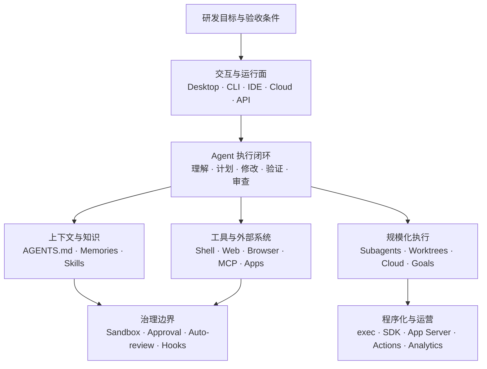

# Codex 研发 Agent 技术白皮书

> 从个人工程闭环到多 Agent、程序化接入与企业治理

> 信息基线：2026-08-10  
> 文档版本：v1.0  
> 文档类型：技术白皮书  
> 证据范围：OpenAI 官方 Codex / ChatGPT 开发者文档；涉及 Vercel Workflow 的段落会明确标为外部扩展。  
> 适合读者：希望系统掌握 Codex 配置、能力边界、高级工作流与平台化接入的研发工程师。

---

## 执行摘要

Codex 最有价值的地方，不是“替你写几段代码”，而是完成一个受权限约束的研发闭环：

> 理解仓库 → 制定方案 → 修改文件 → 运行验证 → 根据结果继续修正 → 审查并交付

要把它真正用好，优先建设四件事：

1. 用 `AGENTS.md` 写清仓库内稳定的工作契约；
2. 用 Sandbox、Approval 与 Auto-review 控制执行风险；
3. 把高频方法沉淀成 Skill，把外部工具接成 MCP，把关键关卡做成 Hook；
4. 任务变大后，再引入子 Agent、worktree、Cloud、SDK 或 App Server。

### 核心结论与能力选型

| 你的问题 | 首选能力 | 原因 |
|---|---|---|
| 当前仓库里实现、调试、测试 | CLI / Desktop 本地任务 | 离代码、终端和验证命令最近 |
| 围绕当前选区快速改代码 | IDE 扩展 | 编辑器上下文最直接 |
| 多个任务并行、需要可视监督 | Desktop App + worktree | 隔离代码状态，也方便监督多个任务 |
| 任务不想占本机，完成后交付 PR | Codex Cloud | 远端隔离执行，适合异步工作 |
| 重复的研发流程 | Skill | 可复用方法、脚本、模板和参考资料 |
| 访问 GitHub、数据库或内部平台 | MCP / App | 提供运行时工具和实时数据 |
| 命令执行前后做检查 | Hook | 确定性生命周期控制 |
| CI 中一次性执行 | `codex exec` / GitHub Action | 非交互、容易做机器化输入输出 |
| 自建研发平台或客户端 | SDK / App Server | 前者偏代码集成，后者提供完整会话协议 |
| 一个目标需要多个角色并行 | Subagents + worktree | 拆分职责，并隔离写入冲突 |
| 跨小时、等待审批、故障后恢复 | 外部 durable workflow | 这不是普通 Codex 会话本身要解决的问题 |

### 阅读导航

- **日常研发**：读第 1～4 章，再看附录 A 的常用命令。
- **团队落地**：读第 3～6 章，重点关注配置、权限、Skill、Hook 与 MCP。
- **平台建设**：读第 5～8 章，再完整阅读命令附录和官方资料索引。

### 正文目录

1. 能力架构与运行边界
2. 日常研发与验证闭环
3. 上下文与配置
4. 安全模型
5. 扩展机制
6. 多 Agent 与隔离并行
7. 程序化接入
8. 高级场景决策
9. 企业治理
10. 采用成熟度模型
11. 附录：CLI、Desktop 与 IDE Slash 命令全集

---

## 研究范围、方法与限制

本白皮书采用“官方能力事实 + 工程决策分析”的方法：

- 只把 OpenAI 第一方 Codex / ChatGPT 开发者文档明确描述的内容视为原生能力；
- 将 CLI/TUI、Desktop App、IDE、Cloud 和程序化接口分别讨论，不假设跨 Surface 等价；
- 将稳定能力、实验能力、账户或组织策略限定能力分开表达；
- 不做缺乏同条件实测的模型质量、速度或成本排名；
- Slash 命令分别按 CLI/TUI 固定全集、App 固定全集与动态入口统计。

本文是 2026-08-10 的能力快照。版本、账户、环境、组织策略、已安装 Skill / Plugin 和运行 Surface 都会改变实际可用集合；运行时应以 `/status`、Slash 菜单及当前官方文档为准。

---

## 1. 能力架构与运行边界

Codex 可以被理解为七层研发执行系统：



这套架构的核心不是生成代码，而是让上下文、工具、权限、并行和验证形成可治理闭环。

### 1.1 工作界面如何选

Codex 在多个界面中共享同一类 Agent 能力，但控制方式、可用工具和适合场景并不完全相同。

| 界面 | 最适合 | 核心优势 | 主要限制 |
|---|---|---|---|
| Desktop App | 多任务监督、长期任务、终端与产物协同 | 项目、worktree、集成终端、文件和可视化查看更自然 | 不适合作为脚本接口 |
| CLI / TUI | 本地开发、调试、快速闭环 | 离 Shell 和 Git 最近；会话、配置、非交互能力完整 | 多任务可视管理弱于 App |
| IDE 扩展 | 当前文件、选区和编辑上下文 | 不必反复描述正在看的代码 | 不适合充当大型任务总控台 |
| Codex Cloud | 隔离的远程任务、异步实现、PR 工作 | 不占本机，可配置云环境 | 依赖本机私有服务时难以复现 |
| SDK / App Server / `exec` | CI、自建平台、自动化 | 可嵌入、可结构化处理 | 不是探索式人机开发的默认入口 |

需要特别记住两点：

- **功能可用性与界面有关。** 浏览器、Computer Use、插件、远程连接、审批 UI 等能力不能默认跨界面存在。
- **Slash 命令也与界面有关。** CLI/TUI 和桌面 App 的固定命令不是同一套，完整清单见附录 A、B。

Desktop 还提供三个容易被低估的能力：

- **Integrated terminal**：聊天与项目或 worktree 对应，可持续观察开发服务器、构建与测试输出；
- **Local environments**：在项目 `.codex` 配置 worktree 初始化脚本与共享 actions；
- **Remote connections**：继续或监督另一台 Desktop 主机上的任务，或使用 SSH 项目。远端主机的凭证、权限和插件仍是真实安全边界。

官方参考：

- [Codex 总览](https://learn.chatgpt.com/docs/codex)、[CLI commands](https://learn.chatgpt.com/docs/developer-commands?surface=cli)、[Integrated terminal](https://learn.chatgpt.com/docs/integrated-terminal)
- [Local environment](https://learn.chatgpt.com/docs/environments/local-environment)、[Cloud environment](https://learn.chatgpt.com/docs/environments/cloud-environment)、[Remote connections](https://learn.chatgpt.com/docs/remote-connections)

---

## 2. 日常研发：把“生成代码”升级为验证闭环

### 2.1 一份高质量任务应该包含什么

不要只说“帮我修一下”。给 Codex 五类信息，结果会稳定很多：

```text
目标：修复订单取消后的重复退款问题。
范围：只改 payment-service；不要改公共网关协议。
证据：先追踪取消事件到退款落库的完整调用链。
验收：运行指定单测、集成测试，并说明未验证项。
交付：解释根因、修改点、风险和回滚方式。
```

核心不是提示词技巧，而是让 Agent 能判断“完成”意味着什么。

### 2.2 推荐的执行节奏

1. **先定位**：入口、调用链、状态变化、已有测试和未知事实；
2. **再计划**：影响多个模块、存在迁移风险或需求模糊时，先用 `/plan`；
3. **小步修改**：一次解决一个可验证假设；
4. **运行验证**：格式化、构建、单测、集成测试、静态检查；
5. **检查差异**：CLI 用 `/diff`，交付前用 `/review`；
6. **明确证据边界**：静态推断、实际运行结果和未验证项分开写。

### 2.3 Web、Browser 与 Computer Use 怎么选

| 需求 | 首选 | 选择理由 |
|---|---|---|
| 查当前版本、官方文档、标准 | Web search | 适合检索外部事实 |
| 操作已有登录态网页、验证页面 | Browser | 能看到并操作真实网页 |
| 操作没有 API/CLI 的本地 GUI | Computer Use | 作为最后一层图形界面能力 |
| 访问结构化系统或实时数据 | MCP / API | 更稳定、可审计、可重复 |
| 阅读或交付图片、PDF、表格、文档、可视化 | Files / Artifacts viewer | 保留原始文件与视觉布局语义 |

推荐优先级是：**结构化 API/MCP → CLI → Browser → Computer Use**。这是可重复性和风险排序，不是能力强弱排序。

官方参考：

- [Prompting](https://learn.chatgpt.com/docs/prompting)、[Best practices](https://learn.chatgpt.com/guides/best-practices)、[Code review](https://learn.chatgpt.com/docs/code-review)
- [Web search](https://learn.chatgpt.com/docs/web-search)、[Browser](https://learn.chatgpt.com/docs/browser)、[Computer Use](https://learn.chatgpt.com/docs/computer-use)、[Files](https://learn.chatgpt.com/docs/artifacts-viewer)

---

## 3. 上下文与配置：把团队经验变成可执行环境

Codex 里最容易混淆的三个知识载体是：

| 载体 | 放什么 | 不该放什么 |
|---|---|---|
| `AGENTS.md` | 仓库命令、架构边界、验收标准、禁改区域 | 大量历史、密钥、临时任务 |
| Memories | 跨会话偏好、长期背景、历史决策 | 本次任务唯一的验收条件 |
| Skill | 可复用方法、脚本、模板、参考资料 | 实时外部数据和凭证 |

### 3.1 `AGENTS.md`：仓库级工作契约

Codex 会组合全局与项目目录中的 `AGENTS.md`。项目内规则从根目录走向当前目录应用，越靠近当前目录的内容越具体；同一目录下，`AGENTS.override.md` 用于覆盖常规文件。

一份有效的 `AGENTS.md` 应回答：

- 如何构建、测试和生成代码；
- 每个目录负责什么，哪些依赖方向不能反转；
- 哪些规则无法由 formatter 或 linter 自动执行；
- 完成任务前必须通过哪些检查；
- 哪些文件、接口或数据不能随意修改。

用 `/init` 可以生成骨架，但生成后仍需人工收敛。不要把整座知识库塞进去；上下文越长并不等于执行越可靠。

### 3.2 Memories：跨任务连续性

Memory 适合保存低频变化、未来仍有价值的信息。它可能受产品界面、功能开关与组织策略影响，因此关键事实仍应落在仓库文件、任务输入或可验证系统中。

### 3.3 Skill：让方法按需加载

Skill 是以 `SKILL.md` 为入口的目录，可以附带脚本、模板、参考资料和资产。Codex 先看名称与描述，匹配任务后再加载完整内容，适合复杂但不应始终占用上下文的流程。

推荐优先做成 Skill 的场景：

- 数据库迁移审查；
- 发布前验收；
- 事故取证和复盘；
- 内部 CLI 或平台操作；
- 固定格式的架构、测试或安全报告。

### 3.4 配置文件管运行策略，不管业务百科

配置用于模型、推理强度、沙箱、审批、Web 搜索、MCP、子 Agent、通知和功能开关。当前官方文档的主要优先级可概括为：

1. 命令行参数和 `--config` 覆盖；
2. 受信任项目中的 `.codex/config.toml`，越靠近当前目录越优先；
3. 选中的 profile；
4. 用户级 `~/.codex/config.toml`；
5. 系统级配置；
6. 内置默认值。

#### 配置控制面

| 配置域 | 主要载体 | 负责什么 |
|---|---|---|
| 模型与推理 | `config.toml`、Profile、CLI、`/model`、`/reasoning` | 默认模型、Reasoning effort、可选服务层 |
| 批准策略 | `approval_policy`、Permissions UI | 哪些动作执行前需要人工确认 |
| 沙箱与网络 | `sandbox_mode`、Workspace-write 配置、Web search | 文件写入根、网络访问和搜索模式 |
| 项目知识 | `AGENTS.md`、`AGENTS.override.md`、Memories | 仓库契约、局部覆盖和跨会话背景 |
| 可复用流程 | Skills、Custom prompts | 按需方法、脚本、模板和显式入口 |
| 外部能力 | MCP、Apps / Connectors、Plugins | 工具、实时数据和能力分发 |
| 生命周期 | Hooks | 执行前后、会话和其他生命周期检查 |
| 多 Agent | `[agents]`、Subagent 定义、worktree | 并发上限、角色和写入隔离 |
| Shell 环境 | `shell_environment_policy` | 继承哪些环境变量和命令环境 |
| 企业治理 | Managed configuration、`requirements.toml` | 限制模型、权限、网络和扩展的可选范围 |
| UI 与通知 | TUI / Desktop 设置、Status line、Notifications | 展示、提醒和终端交互，不承载业务规则 |

下面是一份“本地开发、工作区可写、外网默认关闭”的思路示例。字段和模型仍应以当前账户、客户端版本及官方 reference 为准。

```toml
approval_policy = "on-request"
sandbox_mode = "workspace-write"
web_search = "cached"
model_reasoning_effort = "high"

[sandbox_workspace_write]
network_access = false

[agents]
max_concurrent_threads_per_session = 4
interrupt_message = true

[shell_environment_policy]
inherit = "core"
```

团队通常不需要一份万能配置。维护三套窄基线更清楚：

- `dev`：工作区可写，关键动作询问，网络按需；
- `review`：只读、无网络，专注审查；
- `ci`：非交互、固定输入输出、最小文件和网络权限。

官方参考：

- [AGENTS.md](https://learn.chatgpt.com/docs/agent-configuration/agents-md)、[Memories](https://learn.chatgpt.com/docs/customization/memories)、[Build skills](https://learn.chatgpt.com/docs/build-skills)
- [Config basics](https://learn.chatgpt.com/docs/config-file/config-basic)、[Configuration reference](https://learn.chatgpt.com/docs/config-file/config-reference)

---

## 4. 安全模型：Sandbox、Approval、Auto-review 各管一层

这三者不能互相替代：

| 控制层 | 回答的问题 | 典型作用 |
|---|---|---|
| Sandbox | 动作在技术上能访问什么 | 限制文件写入、网络与系统资源 |
| Approval / Permissions | 哪些动作必须先问人 | 在会话中控制自主程度 |
| Auto-review | 某次动作是否应被策略拦截 | 对高风险尝试再做自动判断 |

`danger-full-access` 与 `approval_policy = "never"` 的组合不是普通“省事模式”：前者取消沙箱，后者取消交互审批。二者同时使用时，错误命令和提示注入都缺少最后的人类闸门。

### 推荐边界

- 默认只允许写当前工作区；
- 外网按任务开放，不把“能联网”当作默认；
- 密钥不要进入 Prompt、Memory、Skill 或仓库指令；
- 数据库写入、生产变更、发布和外部消息保留明确审批；
- 第三方 Skill、Hook、Plugin 与 MCP 按代码依赖审查；
- 自动化环境使用短期、最小作用域凭证。

当动作被 Auto-review 拒绝后，`/approve` 只批准最近一次动作的单次重试。它不是永久放宽策略的开关。

### 4.1 Codex Security 不是普通 `/review`

Codex Security 是独立的应用安全产品能力；普通 `/review` 则是面向当前工作树或分支的代码审查工作流。两者不能互相替代。

对于认证、授权、支付、密钥、解析器、依赖与供应链代码，推荐使用：威胁模型 + 专项安全扫描 + 可执行测试 + Codex Security / 安全审查 + 人工复核。任何单次 Agent Review 都不应被描述为安全证明。

官方参考：[Approvals and security](https://learn.chatgpt.com/docs/agent-approvals-security)、[Sandboxing](https://learn.chatgpt.com/docs/sandboxing)、[Permissions](https://learn.chatgpt.com/docs/permissions)、[Auto-review](https://learn.chatgpt.com/docs/sandboxing/auto-review)、[Codex Security](https://learn.chatgpt.com/docs/security/index)。

---

## 5. 扩展机制：按职责选择，不要全塞进 Prompt

| 机制 | 本质 | 最佳场景 | 常见误用 |
|---|---|---|---|
| Skill | 可复用的方法与资源包 | 团队流程、脚本、模板、专门知识 | 把实时数据硬编码进去 |
| Hook | 生命周期上的确定性动作 | 审计、格式化、校验、阻断危险动作 | 用它承载复杂自主决策 |
| MCP | 运行时工具与数据协议 | GitHub、数据库、工单、内部 API | 为纯方法论搭一个服务 |
| App / Connector | 面向用户选择的外部应用能力 | 将连接器显式附加到任务 | 默认授予所有数据访问 |
| Plugin | 能力的安装与分发单元 | 一起发布 Skill、MCP、Hook 等 | 把它误认为单一运行协议 |

### 5.1 组合范式

一个成熟的“数据库变更助手”可以这样分层：

- Skill：规定分析步骤、风险清单和报告模板；
- MCP：读取 schema、慢查询、迁移记录；
- Hook：在执行迁移前强制校验环境和审批票；
- Plugin：把以上能力作为一个可安装包交付。

这比一条超长 Prompt 更容易版本化、审查和复用。

### 5.2 信任模型

扩展内容会影响 Agent 行为，甚至引入可执行代码或外部数据。安装前至少检查：来源、权限、脚本、网络目标、凭证作用域、更新策略和回滚方式。

官方参考：[Hooks](https://learn.chatgpt.com/docs/hooks)、[MCP](https://learn.chatgpt.com/docs/extend/mcp)、[Plugins](https://learn.chatgpt.com/docs/plugins)、[Build plugins](https://learn.chatgpt.com/docs/build-plugins)。

---

## 6. 多 Agent 与隔离：任务变大后再扩规模

### 6.1 子 Agent 的正确用法

子 Agent 适合“职责可分、结果可验收”的工作：

- 一个追调用链；
- 一个审安全边界；
- 一个分析测试缺口；
- 一个执行独立模块的实现。

最差的拆法是让四个 Agent 都“看看有没有问题”。这只会得到四份重叠意见。

一份可执行的委派应包含：

- 唯一目标；
- 明确读写范围；
- 输入和依赖；
- 验收命令；
- 结果返回格式；
- 何时必须停止并请求决策。

### 6.2 worktree 解决写入冲突

当多个 Agent 会修改代码时，Git worktree 比“大家共享一个工作目录”可靠得多。它隔离文件状态和分支，但不会自动解决语义冲突；合并前仍需测试和审查。

### 6.3 Goal 与后台任务解决持续性，不等于业务编排

`/goal` 让当前任务围绕一个持久目标持续推进；`/ps`、`/stop` 用于管理 CLI 的后台终端。它们适合研发任务持续性，但不等于具备业务级 durable workflow 的状态机、重试、定时器、审批和故障恢复语义。

官方参考：[Subagents](https://learn.chatgpt.com/docs/agent-configuration/subagents)、[Git worktrees](https://learn.chatgpt.com/docs/environments/git-worktrees)、[Long-running work](https://learn.chatgpt.com/docs/long-running-work)。

---

## 7. 程序化接入：五条路线分别解决什么

| 路线 | 适合 | 不适合 |
|---|---|---|
| `codex exec` | Shell/CI 中一次性、非交互执行 | 复杂多会话产品 |
| Codex SDK | 在 TypeScript 等程序中启动和继续任务 | 需要完整客户端协议控制 |
| App Server | 自建 UI、会话管理器、IDE 或多主机控制面 | 只跑一条脚本时过重 |
| `codex mcp-server` | 把 Codex 暴露给另一个 MCP Client / Agent | 面向普通终端用户的交互 |
| GitHub Action | 仓库事件触发的审查、修复和维护 | 跨多个业务系统的通用编排 |

### 7.1 `codex exec`：最短自动化路径

适合 CI、脚本和批处理。设计时固定：工作目录、输入、模型、权限、超时、输出格式、退出码和产物位置。自动化最怕“人能看懂但机器无法判断”的自由文本结果。

### 7.2 SDK：应用代码中的 Agent

当产品只需要“启动任务、接收事件、继续线程、处理结果”时，SDK 通常最直接。它适合内部工具、批处理服务和自定义工作流节点。

### 7.3 App Server：完整客户端协议

App Server 提供线程、回合、流式 Item、审批、认证和配置等能力。它适合构建真正的 Codex 客户端或控制平面。接入时必须区分：

- Thread：可恢复的对话状态；
- Turn：一次用户输入到 Agent 停止的执行周期；
- Item：消息、命令、文件修改、工具调用等流式单元。

“Turn 结束”不一定等于业务任务完成。平台应根据明确结果和验收条件判断，而不是只看协议事件。

### 7.4 GitHub Action 与 Automations

GitHub Action 适合 PR/Issue 驱动的仓库自动化；Desktop Automations 适合定时执行本地任务。二者都需要最小权限、幂等、超时、失败通知和人工接管路径。

官方参考：

- [Non-interactive mode](https://learn.chatgpt.com/docs/non-interactive-mode)、[Codex SDK](https://learn.chatgpt.com/docs/codex-sdk)、[App Server](https://learn.chatgpt.com/docs/app-server)
- [MCP Server](https://learn.chatgpt.com/docs/mcp-server)、[GitHub Action](https://learn.chatgpt.com/docs/github-action)、[Automations](https://learn.chatgpt.com/docs/automations)

---

## 8. 高级场景：什么组合真正值得用

### 场景 A：跨服务重构

**推荐组合**：`/plan` → 调用链与测试基线 → 按模块拆子 Agent → 每个写入任务独立 worktree → 集成 Agent 合并 → `/review`。

**为什么有效**：研究、实现和集成职责分开；每一步都有明确验收证据。

**不要这样用**：让多个 Agent 同时修改同一个工作目录，再指望最后自动消解所有冲突。

### 场景 B：线上疑难问题

**推荐组合**：只读 Sandbox → 日志/指标 MCP → 两个 Agent 分别验证竞争假设 → 最小复现实验 → 人工审批后修改。

**为什么有效**：并行探索的是不同假设，而不是重复搜索；只读环境能避免调查阶段意外改变系统。

### 场景 C：大规模机械迁移

**推荐组合**：先做一个样板模块 → 把转换规则和验收命令沉淀成 Skill → 按目录分片 → worktree 并行 → 统一回归。

**适合**：API 升级、测试框架迁移、配置格式转换、重复性重构。

**不适合**：目标架构尚未稳定、每个模块都需要大量产品判断。

### 场景 D：PR 自动审查与有限修复

**推荐组合**：GitHub Action → 只读审查 → 结构化 finding → 仅对低风险问题自动修复 → 测试 → 人工合并。

**关键边界**：普通 `/review` 是研发审查工作流；Codex Security 是独立的安全产品能力，不应混为一谈。[Codex Security](https://learn.chatgpt.com/docs/security/index)。

### 场景 E：内部研发平台

**推荐组合**：App Server 负责会话协议 → SDK/服务层封装业务任务 → MCP 接内部工具 → managed configuration 限制模型、权限与工具 → 审计与分析 API 做治理。

**适合**：统一研发门户、远程执行集群、企业级 Agent 控制面。

### 场景 F：跨小时、跨审批、可恢复的业务流程

普通 Codex 会话不应承担完整的 durable workflow 语义。需要等待 webhook、人工审批、定时重试、故障恢复和长期状态时，应由外部工作流引擎持有状态，Codex 只作为某个受控步骤。

如果团队使用 Vercel，可考虑 Workflow DevKit / Workflow Agent。这属于外部扩展，不是 Codex 原生能力。参考：[Vercel durable execution](https://vercel.com/blog/a-new-programming-model-for-durable-execution)、[Durable AI code agent](https://vercel.com/kb/guide/how-to-build-a-durable-ai-code-agent-on-vercel)。

---

## 9. 企业治理：从“能运行”走向“可控制”

认证、执行环境与工具权限应被视为一组联动控制：本地任务会继承本机项目与受控 Shell 环境；Cloud 任务依赖配置过的 Cloud environment；远程主机使用宿主机上的凭证和扩展。不要把切换运行 Surface 误认为凭证和数据边界自动保持不变。

企业落地至少要同时管理：

- 谁可以登录、使用哪些模型和执行环境；
- 哪些 Sandbox、Approval 与网络策略允许被选择；
- 哪些 MCP、Plugin、Skill 和 Hook 可以安装或运行；
- 凭证如何发放、轮换和撤销；
- 如何保留审计事件、使用数据和合规记录；
- 失败时谁接管，如何停止自动化。

Managed configuration 和 requirements 的价值是限制可选范围，不只是提供默认值。Analytics 更适合看采用率与使用趋势；Compliance / Audit 能力用于事件审计。具体字段、保留周期和账户范围应以组织方案与当前官方文档为准。

官方参考：

- [Admin setup](https://learn.chatgpt.com/docs/enterprise/admin-setup)、[Governance](https://learn.chatgpt.com/docs/enterprise/governance)、[Managed configuration](https://learn.chatgpt.com/docs/enterprise/managed-configuration)
- [Authentication](https://learn.chatgpt.com/docs/auth)、[Analytics API](https://learn.chatgpt.com/docs/enterprise/analytics-api)、[Compliance API](https://learn.chatgpt.com/docs/enterprise/compliance-api)

---

## 10. 采用成熟度模型

组织不应从最高自主性和最大并发起步。更稳妥的路径是逐级提升能力，并在每一级沉淀可验证、可复用、可治理的工程资产。

### Level 1：单 Agent 可验证闭环

- 熟练使用 `/status`、`/plan`、`/diff`、`/review`、`/compact`；
- 每个任务都给边界、验收命令和未验证项；
- 能区分静态推断与运行证据。

### Level 2：仓库规则与流程资产化

- 写一份短而可执行的 `AGENTS.md`；
- 建立 dev / review / ci 三套窄权限基线；
- 把第一个高频流程做成 Skill；
- 用 Hook 固化一个关键检查点。

### Level 3：隔离并行与任务规模化

- 学会按职责委派子 Agent；
- 对并行写入使用 worktree；
- 为长任务设计阶段性结果和人工接管点。

### Level 4：程序化与平台治理

- 先用 `codex exec` 完成一个非交互任务；
- 再根据产品形态选择 SDK 或 App Server；
- 最后补齐身份、权限、审计、幂等、超时和恢复。

---

## 附录 A：Codex CLI / TUI 全部内置 Slash 命令

> 基线：OpenAI 官方 [CLI built-in slash commands](https://learn.chatgpt.com/docs/developer-commands?surface=cli)，核对日期 2026-08-10。  
> 完整性：下表共 **50 个官方命令条目**；其中 3 行包含官方别名，所以共有 **53 种命令拼写**。  
> 运行中排队：当当前回合尚未结束时，可输入命令后按 `Tab`，让它在下一回合解析执行。

| 命令 | 作用 | 什么时候用 |
|---|---|---|
| `/permissions` | 调整无需询问即可执行的动作 | 在 Auto、只读等权限强度之间切换 |
| `/ide` | 带入打开文件、选区等 IDE 上下文 | 下一步需要当前编辑器现场时 |
| `/keymap` | 查看并修改 TUI 快捷键 | 将自定义按键持久化到配置 |
| `/vim` | 切换 Composer 的 Vim 模式 | 使用 Normal / Insert 编辑习惯时 |
| `/setup-default-sandbox` | 安装增强的 Windows Sandbox | 仅 Windows；替换降级沙箱 |
| `/sandbox-add-read-dir` | 给 Windows Sandbox 增加只读目录 | 仅 Windows；读取当前根之外的绝对路径 |
| `/agent`、`/subagents` | 切换当前子 Agent 线程 | 查看或继续某个已生成 Agent 的工作 |
| `/apps` | 浏览 Apps / Connectors，并插入 `$app-slug` | 将外部应用显式附加到 Prompt |
| `/plugins` | 浏览、安装和管理插件 | 检查插件能力或可用状态 |
| `/hooks` | 查看、信任或禁用生命周期 Hooks | 新 Hook 或内容变化后审查 |
| `/clear` | 清屏并开始全新 Chat | 同时重置可见界面和上下文 |
| `/rename` | 重命名当前 Chat | 让保存的会话容易识别 |
| `/archive` | 归档当前 Session 并退出 | 从活跃列表移走，但保留记录 |
| `/delete` | 永久删除当前 Session 及其后代并退出 | 确定归档仍不够时；不可恢复地使用 |
| `/compact` | 压缩可见对话，释放 Context | 长任务接近上下文上限时 |
| `/copy` | 复制最近完成的回复或 Plan | 无需手选文本；也可用 `Ctrl+O` |
| `/diff` | 显示 Git diff，包括未跟踪文件 | 提交或测试前检查改动 |
| `/exit` | 退出 CLI，与 `/quit` 等价 | 离开当前 CLI 会话 |
| `/experimental` | 开关实验能力 | 试用 Network proxy、防休眠等实验项 |
| `/approve` | 批准最近一次 Auto-review 拒绝动作的单次重试 | 明确判断该动作可安全重试时 |
| `/memories` | 开关 Memory 注入或生成 | 管理当前会话的记忆行为 |
| `/skills` | 浏览和选择 Skill | 显式使用适合当前任务的方法包 |
| `/import` | 导入受支持的 Claude Code 配置、项目和最近 Chat | 从 Claude Code 迁移到 Codex |
| `/feedback` | 发送反馈、日志和诊断信息 | 报告问题或向支持提供现场 |
| `/init` | 在当前目录生成 `AGENTS.md` 骨架 | 初次为仓库建立持久指令 |
| `/logout` | 退出 Codex 账户 | 共享机器上清除本地凭证 |
| `/mcp` | 列出 MCP 工具；`verbose` 查看服务器详情 | 确认外部工具是否连接 |
| `/mention` | 将文件或目录附加到 Chat | 明确下一步需要检查的代码范围 |
| `/model` | 选择模型及可用的推理强度 | 在任务开始前调整能力和成本 |
| `/fast` | 开关模型目录提供的 Fast 服务层 | 当前模型支持 Fast tier 时 |
| `/plan` | 进入 Plan 模式，可同时发送问题 | 多步骤或高风险改动前先形成方案 |
| `/goal` | 设置、查看、编辑、暂停、恢复或清除持久目标 | 需要围绕一个大目标持续推进时 |
| `/personality` | 选择回复风格 | 调整简洁、解释性或协作风格 |
| `/ps` | 查看后台终端及最近输出 | 检查长时间运行的命令 |
| `/stop` | 停止当前 Session 的所有后台终端 | 取消后台构建、测试或服务 |
| `/fork` | 从当前 Chat 分叉新 Chat | 探索另一方案而不破坏现有上下文 |
| `/app` | 在桌面 App 中继续当前 Session | 从 TUI 转移到 macOS / Windows App |
| `/side`、`/btw` | 启动临时 Side Chat | 问一个不应干扰主上下文的问题 |
| `/raw` | 切换原始 Scrollback | 长输出中更方便选择和复制文本 |
| `/resume` | 从列表恢复已保存 Chat | 继续之前的 CLI 工作 |
| `/new` | 在同一 CLI 中开始全新 Chat | 保留当前仓库，但清空 Chat 上下文 |
| `/quit` | 退出 CLI | 结束当前 CLI 会话 |
| `/review` | 审查当前工作树 | Agent 完成后或提交前复核 |
| `/status` | 显示模型、权限、可写根、Token 等 Session 状态 | 确认真实运行配置和剩余上下文 |
| `/usage` | 查看账户 Token 使用或限额重置信息 | 检查日、周或累计使用情况 |
| `/debug-config` | 输出配置层和 requirements 诊断 | 排查优先级、策略和实验网络约束 |
| `/statusline` | 交互配置 TUI 底部状态字段 | 持久化模型、Context、Git、Token 等显示 |
| `/title` | 配置终端窗口或 Tab 标题字段 | 显示项目、线程、分支、模型或任务进度 |
| `/theme` | 选择语法高亮主题 | 预览并保存终端主题 |
| `/pets`、`/pet` | 选择或隐藏 TUI Pet | 个性化终端环境 |

### CLI 命令里最值得形成肌肉记忆的八个

`/status` → `/plan` → `/permissions` → `/mention` → `/diff` → `/review` → `/compact` → `/resume`

它们分别解决：确认现场、先规划、控制权限、缩小范围、检查改动、独立复核、管理上下文和恢复工作。

---

## 附录 B：Desktop App 与 IDE Composer 全部固定 Slash 命令

> 基线：OpenAI 官方 [Slash commands reference](https://learn.chatgpt.com/docs/reference/slash-commands)，核对日期 2026-08-10。  
> Desktop App 下表共 **24 个固定命令**。可用性受环境、账户和组织策略影响；它不是 CLI/TUI 命令表的子集或替代品。

| 命令 | 作用 | 条件或提醒 |
|---|---|---|
| `/approve` | 批准最近一次 Auto-review 拒绝动作的单次重试 | 仅在自动审查启用且存在最近拒绝时 |
| `/cloud` | 在 Cloud 中运行 Chat | 需要账户具备 Cloud execution |
| `/cloud-environment` | 为 Chat 选择 Cloud 环境 | 与项目云环境配置配合 |
| `/compact` | 压缩当前 Chat 上下文 | 长任务释放 Context |
| `/fast` | 开关模型目录提供的 Fast tier | 仅可用时出现 |
| `/feedback` | 打开反馈窗口，可附带日志 | 用于问题反馈和诊断 |
| `/fork` | 将本地 Chat 复制为新本地 Chat 或 worktree | 分支探索或隔离实现 |
| `/goal` | 设置持久目标 | 官方建议先用 `/plan` 把目标定义清楚 |
| `/ide-context` | 开关 IDE 共享上下文 | 控制编辑器信息是否进入 Chat |
| `/init` | 生成当前项目的 `AGENTS.md` 骨架 | 生成后仍需人工精简 |
| `/local` | 在选中的本地项目运行 Chat | 需要已选择本地项目 |
| `/mcp` | 打开 MCP 状态 | 查看连接的服务器 |
| `/memories` | 配置 Memory 使用或生成 | 仅 Memories 可用时 |
| `/model` | 选择当前 Chat 模型 | 可选项受账户和组织策略影响 |
| `/pet` | 唤醒或收起 Desktop Pet | 桌面个性化功能 |
| `/personality` | 选择 Codex 回复风格 | 仅当前模型支持时 |
| `/plan` | 开关 Plan 模式 | 多步骤任务先规划 |
| `/project` | 为新 Chat 选择项目 | 决定项目上下文 |
| `/reasoning` | 选择当前 Chat 的推理强度 | 任务越复杂不代表必须始终最高 |
| `/review` | 审查未提交改动或与基线分支比较 | 进入代码审查模式 |
| `/side` | 启动不打断主 Chat 的临时 Side Chat | 临时问题不污染主上下文 |
| `/status` | 显示 Chat ID、Context 使用量和限额 | 排查现场的首选命令 |
| `/task` | 启动不绑定项目的 Chat | 适合一般任务 |
| `/worktree` | 在新 Git worktree 中运行 Chat | 隔离并行代码修改 |

### IDE Extension 的固定集合

VS Code / IDE Composer 的官方固定集合为 **22 个命令**，即上表除 `/pet`、`/task` 外的全部命令：

`/approve`、`/cloud`、`/cloud-environment`、`/compact`、`/fast`、`/feedback`、`/fork`、`/goal`、`/ide-context`、`/init`、`/local`、`/mcp`、`/memories`、`/model`、`/personality`、`/plan`、`/project`、`/reasoning`、`/review`、`/side`、`/status`、`/worktree`。

其中 `/fork` 在 IDE 文档中描述为复制到新的本地 Chat；Desktop App 还可结合 worktree。IDE 同时有 Command Palette 命令，但它们不是 Slash 命令，不计入本附录。官方参考：[IDE developer commands](https://learn.chatgpt.com/docs/developer-commands?surface=ide)。

### 动态出现的 Slash 入口

“所有命令”还需要理解动态部分：它们无法用一张全球固定表枚举，因为取决于本机安装和当前组织策略。

- 已启用的 **Skills** 会出现在 Slash 列表中；官方也支持在 Composer 中用 `$` 显式调用 Skill；
- 自定义 Prompt 以 `/prompts:<name>` 出现；
- Plugin 安装或组织管理的能力可能增加动态入口；
- ChatGPT Web 有自己的 Composer 菜单，不保证暴露桌面 App 或 CLI 的全部命令。

因此，严谨的全集定义是：**附录 A 的 CLI 固定全集 + 附录 B 的 App / IDE 固定全集与 Surface 差异 + 当前环境动态枚举结果**。运行时输入 `/` 查看菜单，才是本机最终可用集合。

---

## 官方资料索引

### 核心与界面

- [Codex overview](https://learn.chatgpt.com/docs/codex)
- [CLI commands and built-in Slash commands](https://learn.chatgpt.com/docs/developer-commands?surface=cli)
- [App Slash commands](https://learn.chatgpt.com/docs/reference/slash-commands)
- [IDE commands and Slash commands](https://learn.chatgpt.com/docs/developer-commands?surface=ide)
- [Models](https://learn.chatgpt.com/docs/models)
- [Projects](https://learn.chatgpt.com/docs/projects)
- [Local environment](https://learn.chatgpt.com/docs/environments/local-environment)
- [Cloud environment](https://learn.chatgpt.com/docs/environments/cloud-environment)
- [Git worktrees](https://learn.chatgpt.com/docs/environments/git-worktrees)

### 配置、知识与扩展

- [Configuration basics](https://learn.chatgpt.com/docs/config-file/config-basic)
- [Configuration reference](https://learn.chatgpt.com/docs/config-file/config-reference)
- [AGENTS.md](https://learn.chatgpt.com/docs/agent-configuration/agents-md)
- [Memories](https://learn.chatgpt.com/docs/customization/memories)
- [Skills](https://learn.chatgpt.com/docs/build-skills)
- [Hooks](https://learn.chatgpt.com/docs/hooks)
- [MCP](https://learn.chatgpt.com/docs/extend/mcp)
- [Plugins](https://learn.chatgpt.com/docs/plugins)
- [Subagents](https://learn.chatgpt.com/docs/agent-configuration/subagents)

### 安全、自动化与企业

- [Approvals and security](https://learn.chatgpt.com/docs/agent-approvals-security)
- [Sandboxing](https://learn.chatgpt.com/docs/sandboxing)
- [Permissions](https://learn.chatgpt.com/docs/permissions)
- [Non-interactive mode](https://learn.chatgpt.com/docs/non-interactive-mode)
- [Codex SDK](https://learn.chatgpt.com/docs/codex-sdk)
- [App Server](https://learn.chatgpt.com/docs/app-server)
- [GitHub Action](https://learn.chatgpt.com/docs/github-action)
- [Enterprise governance](https://learn.chatgpt.com/docs/enterprise/governance)

---

## 结论与实施建议

白皮书的核心结论是：Codex 的工程价值来自“可执行上下文 + 最小权限工具 + 验证闭环 + 恰当编排”，而不是单次生成质量。团队实施时应坚持“先闭环、后复用；先隔离、后并行；先证据、后自主”。

真正掌握 Codex，不是记住所有命令，而是能稳定做出以下判断：

1. 这个任务应在本地、Cloud、IDE 还是程序化接口中运行？
2. 哪些事实应放进 `AGENTS.md`、Memory、Skill 或 MCP？
3. 需要什么 Sandbox 和 Approval 边界？
4. 是否真的值得拆子 Agent，写入是否需要 worktree？
5. 完成标准是什么，证据来自静态分析还是实际运行？
6. 当前问题是一次研发任务，还是需要外部 durable workflow 的长期业务流程？

能回答这六个问题，Codex 才从“会聊天的代码工具”变成你可以设计、约束和复用的研发 Agent。
