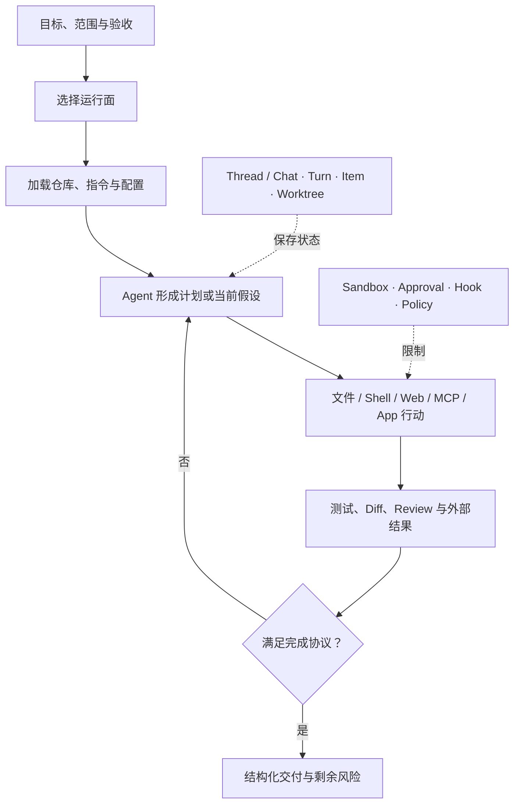

> 在本地、云端、桌面与程序化接口之间设计同一套受控执行

> 信息基线：2026-08-10  
> 文档版本：v2.0  
> 文档类型：技术白皮书  
> 证据范围：OpenAI 官方 Codex / ChatGPT 开发者文档与必要的官方开源实现  
> 目标读者：希望系统掌握 Codex、建立团队规范或构建研发 Agent 平台的工程师与技术负责人

---

## 导读：先回答谁拥有环境、状态与批准权

设想一个假设场景：同一条“升级鉴权 SDK 并修复所有兼容问题”的任务，在本地 CLI 中顺利完成，搬到 Cloud 后却卡在私有依赖；在 Desktop 的 worktree 中测试通过，合回主分支后又因为共享数据库状态失败；接入 App Server 后，平台把 `turn/completed` 当成业务完成，结果在验收尚未通过时提前通知了用户。

这些失败看起来分别属于依赖、测试和协议，背后却有同一个问题：没有说清楚谁拥有执行环境、任务状态和批准权。

Codex 不是一个界面。CLI、Desktop、IDE、Cloud、`codex exec`、SDK 与 App Server 提供的是不同控制方式，但它们都围绕同一个研发执行过程工作：理解代码与目标，采取受限行动，读取结果，再根据证据继续修正。

本文的中心判断是：

> Codex 的工程价值不只来自模型能做什么，而来自环境、状态、权限和证据被分配给谁。选对运行面只是开始；真正可靠的系统，还要让每一次任务拥有明确的工作契约、行动边界、完成协议和接管路径。

正文不会按产品菜单逐项介绍能力，而是沿着一条决策路径展开：

1. 任务应该在哪个运行面执行？
2. 代码、依赖、凭证和工作状态由谁持有？
3. 仓库规则、配置、权限和扩展如何共同构成控制面？
4. 什么结果能够证明任务完成，而不是只证明某个回合结束？
5. 任务扩大后，应选择 Subagent、worktree、Cloud、SDK 还是 App Server？

CLI、Desktop 与 IDE 的完整 Slash 命令放在附录。本文是 2026-08-10 的能力快照；模型、账户、组织策略、客户端版本、Surface、实验开关和已安装扩展都会改变实际集合，运行时应以 `/status`、Slash 菜单和当前官方文档为准。官方未给某项能力标注成熟度时，本文也不会自行把它命名为 Stable。[Feature maturity](https://learn.chatgpt.com/docs/feature-maturity)

## 执行摘要

Codex 可以被理解为一个跨多个运行面的研发执行系统：模型负责判断，工具改变代码和环境，AGENTS.md 与配置提供上下文和策略，Sandbox 与 Approval 限制动作，测试与 Review 把结果重新送回循环。

```text
任务契约
   ↓
上下文与仓库状态
   ↓
Agent 判断 → 工具行动 → 环境结果 → 验证与修正
   ↑                                │
   └──────── 状态与证据 ────────────┘

控制面：配置 · Sandbox · Approval · Hook · Managed policy
运行面：Desktop · CLI · IDE · Cloud · exec · SDK · App Server
```

工程上最重要的结论有六个：

- Surface 的差别不是 UI 偏好，而是执行现场、可用工具、凭证、会话状态和人机交互方式的差别。
- `AGENTS.md` 是仓库工作契约，Config 是运行策略，Memory 是跨任务连续性，Skill 是按需方法；把它们混成一份上下文会增加噪声和冲突。
- Sandbox 回答“技术上能触达什么”，Approval 回答“何时必须先问人”，Auto-review 回答“当前动作是否应被自动拦截”；三者不能互相替代。
- Subagent 适合有边界的独立工作，worktree 适合隔离 Git 写入；它们不会自动隔离数据库、端口和云资源。
- `codex exec`、SDK、App Server、MCP Server 与 GitHub Action 分别面向脚本、应用、完整客户端协议、Agent-to-Agent 工具暴露和仓库事件；不是从低级到高级的一条直线。
- 协议事件只能说明执行状态。平台必须用显式结果、验收证据和业务状态判断完成，不能把 Turn 结束、线程空闲或一段 Final 文本直接当作任务成功。

一句话实施原则是：

> 先确定环境、状态与权限的所有者，再让 Agent 行动；先定义完成协议，再谈并发与自动化。

---

## 1. 最小模型：执行面与控制面共同决定结果

Codex CLI 的官方定位是让 Agent 在终端中检查代码、修改文件、运行命令，并通过 `codex exec` 进入脚本与 CI。[Codex CLI](https://learn.chatgpt.com/docs/codex/cli) Desktop、IDE 与 Cloud 改变了交互和环境，但没有取消同一个基本循环。



这套模型把 Codex 分为两部分：

- **执行面**决定代码和命令在哪里运行、怎样与人交互、任务能持续多久；
- **控制面**决定加载哪些规则、允许哪些动作、如何保存状态、怎样判断完成。

许多“模型表现不稳定”其实来自控制面不完整：Cloud 缺少私有依赖，CLI 没有加载正确的局部 `AGENTS.md`，自动化遇到审批却无人响应，多个 Worker 共享数据库导致测试互相污染。

开始任务前，用四问检查现场：

| 问题 | 需要明确的内容 |
|---|---|
| 环境属于谁？ | 本机、Cloud VM、远程主机、容器还是 CI Runner |
| 状态属于谁？ | 当前 Chat / Thread、分支、worktree、外部任务库还是调用者 |
| 权限属于谁？ | 用户交互审批、项目配置、组织策略还是自动化服务账户 |
| 完成由谁证明？ | 测试、构建、真实运行、人工验收或外部业务状态 |

## 2. 运行面选型：不要只看“在哪里聊”

| 运行面 | 执行现场 | 最适合 | 主要取舍 |
|---|---|---|---|
| Desktop App | 本地项目、可选 worktree、集成终端 | 多任务监督、长期任务、Diff、产物和终端协同 | 不适合作为脚本协议 |
| CLI / TUI | 当前本地目录与 Shell | 调试、测试、仓库改动、深度配置 | 多任务可视管理弱于 Desktop |
| IDE 扩展 | 当前编辑器与项目 | 当前文件、选区、Inline diff、快速迭代 | 不适合充当复杂平台控制面 |
| Codex Cloud | 配置好的远程环境 | 异步实现、隔离执行、交付分支或 PR | 无法天然复用本机未提交状态和私有服务 |
| `codex exec` | 调用者提供的 Shell / CI 环境 | 一次性、非交互、机器化执行 | 必须预先处理权限与输出协议 |
| TypeScript / Python SDK | 本地 CLI 或 App Server 所在进程与工作目录 | 在代码中启动、继续和消费 Agent 任务 | 两种 SDK 的底层接口与成熟度不同 |
| App Server | Codex 核心进程，由客户端驱动 | 自建 UI、IDE、会话管理器和控制平面 | 协议、审批、恢复和版本兼容成本更高 |

这张表描述的是任务形状，不是成熟度排名。当前官方把 `codex` 与 `codex exec` 命令列为 Stable，把 `codex cloud` 子命令和 App Server 命令列为 Experimental；这不等于 CLI、Cloud 产品或 Desktop 整体共享同一标签。成熟度必须落到具体能力上判断。

### 2.1 Local 与 Cloud 的分界

本地任务天然接近开发者的未提交代码、私有依赖、调试工具和凭证；Cloud 任务天然接近可复现、可丢弃和异步运行的环境。两者都不是绝对更安全或更强。

适合 Local 的信号：

- 依赖本机服务、硬件、私有网络或尚未提交的改动；
- 需要频繁观察、纠正和调试；
- 任务结果必须立即与本地分支交互。

适合 Cloud 的信号：

- 仓库和环境可以从配置重建；
- 任务边界清楚，可异步交付；
- 希望隔离本机或并行运行多个独立任务。

Cloud environment 必须显式准备依赖、环境变量、网络和启动脚本。Setup 阶段与 Agent 阶段可以拥有不同网络策略；Secret 只在 Setup 阶段提供，不能假设运行中的 Agent 仍能读取。把任务发送到 Cloud 并不会自动复制本机的隐含前提。[Local environment](https://learn.chatgpt.com/docs/environments/local-environment) · [Cloud environment](https://learn.chatgpt.com/docs/environments/cloud-environment)

### 2.2 Desktop 适合监督，CLI 适合贴近 Shell

Desktop 把项目、Chat、托管 worktree、终端、Diff、文件和可视化产物组织成一个监督界面。官方托管的 Git worktree 是 Desktop 能力；CLI 中的 Subagent 不会因此自动得到独立 worktree。CLI 更接近 Shell，适合命令密集、低延迟和可脚本化的本地循环。

同一个任务可以在两者之间流动，但不要假设 Slash 命令、审批界面和全部工具完全相同。附录按 CLI/TUI、Desktop 与 IDE 分开列出命令，就是为了保留这种边界。

## 3. 状态模型：Thread 结束不等于任务完成

在交互产品里，用户通常看到 Project、Chat、任务和分支；在 App Server 中，核心协议进一步区分 Thread、Turn 与 Item：

- **Thread** 保存可恢复的对话和执行上下文；
- **Turn** 表示一次输入驱动的 Agent 执行周期；
- **Item** 是消息、命令、文件改动、工具调用等流式单元。

这个层次很重要，因为协议层“停止产生 Item”只说明当前 Turn 结束。它可能成功完成，也可能失败、被取消、等待输入，或者只完成业务任务的一部分。构建客户端时，不应根据 `turn/completed`、空闲状态或 Final 文本猜测业务结果；应保存显式任务状态、验收证据和结果摘要。[App Server](https://learn.chatgpt.com/docs/app-server)

### 3.1 文件状态与会话状态是两条轴

Chat / Thread 可以继续同一段判断历史，Git 分支或 worktree 保存代码状态。它们不是一一绑定的事务：

- 恢复 Chat 不会自动撤销仓库后来发生的变化；
- 切换分支不等于清空 Agent 对话；
- 多个 Session 写同一工作区会互相看到文件变化；
- worktree 隔离文件与分支，但不隔离数据库、端口、缓存和云资源。

因此，长任务要同时设计：会话如何恢复、文件如何隔离、中间结果放哪里、外部资源怎样命名、失败后谁负责清理。

## 4. 上下文与配置：把知识和运行策略分开

Codex 中最常被混为一谈的四种载体是：

| 载体 | 应保存 | 生命周期 | 不应承担 |
|---|---|---|---|
| `AGENTS.md` / `AGENTS.override.md` | 仓库命令、模块边界、验收和禁改区域 | 随目录层次进入项目上下文 | 临时任务和密钥 |
| Memories | 跨任务偏好、历史决策和长期背景 | 跨 Chat / 任务持续 | 当前任务唯一的完成条件 |
| Skill | 可复用方法、脚本、模板和参考 | 相关时按需加载 | 实时外部数据与永久全局规则 |
| `config.toml` / Profile / Requirements | 模型、推理、Sandbox、Approval、MCP、Agent 与 UI 策略 | 启动和运行时解析 | 业务百科与架构长文 |

### 4.1 `AGENTS.md` 是仓库工作契约

Codex 在一次运行或 TUI 会话开始时构造指令链：全局目录优先选择 `AGENTS.override.md`，否则读取 `AGENTS.md`；项目内则从仓库根一路走到当前目录，每层最多选择一个指令文件，越靠近当前目录优先级越高。默认组合大小上限为 32 KiB。它是工作上下文，不是权限系统或任务数据库。[AGENTS.md](https://learn.chatgpt.com/docs/agent-configuration/agents-md)

一份有效的项目文件应回答：

```markdown
# Repository contract

- 使用 `./mvnw`，不要依赖机器全局 Maven。
- `api` 只能依赖 `application`，不得直接访问 `infra`。
- 修改公开 Schema 时同时更新兼容性测试和迁移说明。
- 完成前运行 `./mvnw verify -Pci`。
- 未经明确授权，不推送分支、不部署、不写生产数据。
```

这些内容会改变 Agent 的命令、搜索路径、依赖判断和完成条件。`/init` 可以生成骨架，但生成结果仍需人工删去显然事实、补上真正隐含的不变量。

### 4.2 配置控制的是运行策略

Codex 配置同时控制模型和完整的运行策略：

| 配置域 | 决定什么 |
|---|---|
| 模型与推理 | 默认模型、Reasoning effort 和可选服务层 |
| Approval | 哪些动作需要人工确认或如何处理无人交互 |
| Sandbox 与网络 | 可写目录、文件系统边界和网络访问 |
| Shell 环境 | 继承哪些环境变量，命令在什么环境中运行 |
| MCP、Plugin 与 Hook | 外部工具、分发能力和生命周期动作 |
| Subagent 与并发 | 可用角色、并发上限和委派方式 |
| Managed configuration / requirements | 组织允许选择的模型、权限和扩展范围 |

一份偏本地开发的思路示例：

```toml
approval_policy = "on-request"
sandbox_mode = "workspace-write"
web_search = "cached"
model_reasoning_effort = "high"

[sandbox_workspace_write]
network_access = false

[agents]
max_concurrent_threads_per_session = 4

[shell_environment_policy]
inherit = "core"
```

这不是万能模板。字段、枚举和层级应以当前 [Configuration reference](https://learn.chatgpt.com/docs/config-file/config-reference) 为准。团队更适合维护几套窄 Profile：本地开发、只读 Review、无人交互 CI，而不是一份同时满足所有任务的高权限配置。

配置优先级从高到低依次是：CLI 参数与 `--config`、可信项目中的逐层 `.codex/config.toml`、`--profile`、用户配置、系统配置和内置默认值。不可信项目不会加载项目级 Config、Hook 与 Rule；组织的 `requirements.toml` 是约束用户可选范围的上限，不只是另一份默认配置。[Config basics](https://learn.chatgpt.com/docs/config-file/config-basic)

### 4.3 Memory 与 Skill 的边界

Memory 保存未来仍有价值的连续性，Skill 保存一类任务可重复执行的方法。关键仓库事实仍应进入版本控制；关键安全约束仍应进入 Sandbox、Approval、Hook 或组织策略。

如果一个流程只偶尔出现，但包含稳定步骤、脚本和模板，它适合 Skill；如果一条规则每次进入仓库都必须遵守，它更适合 `AGENTS.md`；如果数据每次都会变化，应通过 MCP、App 或 CLI 读取，而不是写进二者。

## 5. 安全模型：Sandbox、Approval 与 Auto-review 各管一层

```text
Sandbox      ：动作在技术上能触达什么
Approval     ：哪些动作执行前必须问人
Auto-review  ：当前尝试是否应被策略自动拦截
Hook / Policy：固定事件和组织边界必须发生什么
```

把 `danger-full-access` 与 `approval_policy = "never"` 同时启用，会同时拿掉系统隔离和交互闸门。它不是普通的“省事模式”，只应出现在调用者已经提供强隔离、无敏感凭证且可整体丢弃的环境中。[Approvals and security](https://learn.chatgpt.com/docs/agent-approvals-security) · [Sandboxing](https://learn.chatgpt.com/docs/sandboxing)

Codex 还提供处于 Beta 的 Permission profiles，用细粒度文件系统和网络规则组合执行边界。它与传统 `sandbox_mode` 不是两层叠加：存在旧式 Sandbox 配置或显式 `--sandbox` 时，通常会回退到传统机制。迁移前应先确认实际生效的是哪套策略，而不是根据两个配置文件同时存在就推断“双重保护”。[Permissions](https://learn.chatgpt.com/docs/permissions)

### 5.1 从调查到执行逐步放权

高影响任务可以分成三个权限阶段：

1. **调查**：只读代码、日志和配置，不拥有生产写入；
2. **实现**：允许写当前 worktree，运行可信构建与测试；
3. **交付**：推送、创建 PR、部署或写外部系统时单独审批。

这比在任务开始时一次授予所有权限更符合信息变化：只有调查以后，人才知道实现需要什么；只有验证以后，才知道是否值得交付。

### 5.2 扩展也是供应链

Skill、Hook、Plugin、MCP 与项目脚本都可能改变 Agent 行为，部分还会执行代码或访问外部数据。安装前至少检查：来源、脚本、网络目标、凭证作用域、更新策略和禁用路径。

密钥不要进入 Prompt、Memory、Skill 或仓库指令。自动化使用短期、最小作用域凭证；生产修改、外部消息和不可逆动作保留明确审批。

`/approve` 只应被理解为对最近一次 Auto-review 拒绝动作的单次重试许可，不是永久放宽安全策略。

## 6. 证据闭环：完成必须能被另一个系统判断

一个可执行任务不需要写成长篇 Prompt，但要给 Codex 足够的证明责任：

```text
目标：升级所有服务的鉴权 SDK，并保持外部协议兼容。
范围：先处理 auth-client 的三个调用方；不修改登录产品逻辑。
先做：建立版本、调用点、兼容层和测试基线。
约束：一次只迁移一个服务；公共 Schema 变化必须先报告。
验收：旧版本行为测试保持通过；新增弃用 API 检查；运行集成测试。
交付：列出已迁移、未迁移、失败原因、验证命令和剩余风险。
```

它把“升级完成”变成可检查状态，而不是 Agent 自己的一句话。

### 6.1 可靠执行的顺序

```text
确认现场与配置
  → 定位调用关系和未知事实
  → Plan 收敛方案与迁移顺序
  → 小步修改
  → 构建、测试和真实运行
  → Diff 与独立 Review
  → 结构化结果和未验证项
```

`/status` 负责确认模型、权限、可写根和 Context；`/plan` 负责高影响任务先调查；`/diff` 负责看实际改了什么；`/review` 提供独立审查视角。它们是同一闭环的不同环节，不是互相替代的“最佳命令”。

### 6.2 Review 不是安全证明

普通 `/review` 面向工作树或分支差异；Codex Security 是独立的应用安全能力。认证、授权、支付、密钥、解析器和供应链代码仍需要威胁模型、专项测试、扫描与人工复核。[Codex Security](https://learn.chatgpt.com/docs/security)

最终交付应区分：

- 实际运行的命令、环境与结果；
- 从代码和配置得到但未运行的推断；
- 受权限、数据或业务决定限制而仍未知的部分。

对于平台调用，再增加机器可判定字段：状态、摘要、产物、验证项、失败类型、是否需要人工输入。自由文本可以解释结果，不能独自承担状态协议。

## 7. 扩展机制：按职责组合，不要把一切都塞进 Prompt

| 机制 | 本质 | 最佳场景 | 常见误用 |
|---|---|---|---|
| Skill | 可复用的方法、脚本和资源包 | 发布、迁移、审查、事故取证等稳定流程 | 把实时数据和凭证写进去 |
| Hook | 生命周期上的确定性动作 | 格式化、审计、校验、阻断和记录 | 承载长时间自主业务流程 |
| MCP | Agent 与外部工具或数据的协议 | GitHub、数据库、工单、内部平台 | 为纯文字方法搭服务 |
| App / Connector | 用户显式附加的外部应用能力 | 利用已有账户上下文与数据 | 默认授予所有连接器访问 |
| Plugin | 能力的安装、组合与分发单元 | 一起发布 Skill、MCP、Hook 和资源 | 把它误认为单一执行协议 |

边界仍然要落到具体 Surface。Desktop、CLI 与 IDE 在同一主机上共享 MCP 配置，Web / Cloud 不会自动读取本机 MCP；Hook 当前只执行 Command handler，Prompt / Agent handler 会被跳过，托管 Web Search 也不经过本地 Hook。Skill 脚本则继续受 Sandbox 与 Approval 控制。于是 Hook 是确定性自动化和附加守卫，却不是覆盖所有工具的安全边界。[MCP](https://learn.chatgpt.com/docs/extend/mcp) · [Hooks](https://learn.chatgpt.com/docs/hooks)

### 7.1 用介入点判断机制

以“数据库变更助手”为例：

- Skill 规定审查顺序、锁风险、回滚要求和报告模板；
- MCP 读取实时 Schema、慢查询和迁移记录；
- Hook 在执行迁移命令前校验环境和审批票；
- Plugin 在这套能力稳定以后负责安装与升级；
- `AGENTS.md` 只保留仓库内长期有效的迁移目录和禁令。

这套分层让每项能力拥有明确的作用域、触发方式和信任边界。[Build skills](https://learn.chatgpt.com/docs/build-skills) · [Hooks](https://learn.chatgpt.com/docs/hooks) · [MCP](https://learn.chatgpt.com/docs/extend/mcp) · [Plugins](https://learn.chatgpt.com/docs/plugins)

### 7.2 一个扩展是否值得存在

先问四个问题：

1. 它解决的是稳定重复问题，还是一次性需求？
2. 输入、输出和失败方式是否已经清楚？
3. 它需要方法、实时工具、确定性事件，还是分发能力？
4. 谁审查它的更新，怎样快速禁用和回滚？

如果这些问题还没有答案，先在项目内用窄流程验证，不急着打包成全局 Plugin。

## 8. 多 Agent 与隔离：先分清责任，再增加线程

Subagent 的价值不在“多一个模型”，而在独立上下文、明确工具和可验收委派。适合交给 Subagent 的工作通常边界清楚，并能返回一份压缩结果：调用链调查、日志归因、安全审查、测试缺口分析、独立模块实现。

一份可执行委派至少包含：

- 唯一目标；
- 明确的读写范围；
- 输入事实与依赖；
- 验收命令或证据；
- 结果返回格式；
- 必须停止并请求决策的条件。

“四个 Agent 都看看有没有问题”不会获得四倍质量，只会获得四份重叠意见。[Subagents](https://learn.chatgpt.com/docs/agent-configuration/subagents)

截至本文基线，`features.multi_agent` 标为 Stable 且默认开启；自定义 Agent 配置格式仍可能演进。Subagent 继承当前 Sandbox，并分别消耗上下文与模型调用；在非交互执行中，新的审批请求会失败。因此，委派前要把所需权限准备好，不能指望后台 Worker 临时等人点确认。

### 8.1 Worktree 解决文件所有权，不解决所有共享状态

多个 Agent 会写代码时，让每个任务拥有独立 worktree 和分支，比共享工作目录更可靠。托管 worktree 目前由 Desktop 提供，而且可能以 detached HEAD 开始；Subagent 本身并不承诺自动创建 worktree。它能够隔离 Git 文件状态，却不会自动隔离：

- 本地数据库和测试数据；
- 固定端口与后台服务；
- 云资源、队列和缓存；
- 共享测试账户和外部 API 配额。

因此，并行方案要同时给代码和外部资源分配所有权。[Git worktrees](https://learn.chatgpt.com/docs/environments/git-worktrees)

### 8.2 Goal 与后台终端解决持续性，不等于 Durable Workflow

`/goal` 可以让当前任务围绕持久目标继续推进；`/ps` 和 `/stop` 管理后台终端。它们适合研发过程持续性，但不提供业务级状态机、定时器、跨进程恢复、人工审批和 Exactly-once 副作用语义。[Long-running work](https://learn.chatgpt.com/docs/long-running-work)

当流程必须跨小时等待外部事件、在故障后恢复，并协调多个非 Codex 系统时，应由外部持久工作流持有业务状态，Codex 只执行受控步骤。

## 9. 程序化接入：六条路线是不同产品形态

| 路线 | 主要抽象 | 最适合 | 当前边界 |
|---|---|---|---|
| `codex exec` | 一次非交互执行 | Shell、CI、批处理和结构化检查 | Stable；默认只读；不能在运行中等待人批准 |
| TypeScript SDK | 封装本地 CLI 的 Thread API | Node 服务中启动、继续和消费本地 Codex 任务 | 不是独立远程 Codex API；官方未给整体成熟度标签 |
| Python SDK | 本地 App Server 的高层封装 | Python 中控制 Thread、Turn 和事件 | Beta；携带固定 CLI Runtime |
| App Server | Thread / Turn / Item 双向协议 | 自建富客户端、IDE、会话管理和多主机控制 | 命令与 WebSocket Transport 为 Experimental；当前不面向生产工作负载 |
| `codex mcp-server` | 向 MCP Client 暴露 Codex 能力 | 让另一个 Agent 或 Agents SDK 调用 Codex | Stable；不是构建 Codex UI 的客户端协议 |
| GitHub Action | 仓库事件触发 | PR / Issue 审查、修复和维护 | 仍需治理触发者、Token、Secret 与分支保护 |

它们不是“脚本、低代码、高级平台”的递进关系。应根据调用者需要控制的状态量选择。

### 9.1 `codex exec`：先证明任务可机器化

一次性自动化应固定：工作目录、输入、模型、Sandbox、Approval、网络、超时、输出格式、退出码和产物位置。最危险的输出不是报错，而是一段人看起来满意、机器却无法判断是否成功的自由文本。[Non-interactive mode](https://learn.chatgpt.com/docs/non-interactive-mode)

### 9.2 SDK：先分清它封装的是 CLI 还是 App Server

TypeScript SDK 通过标准输入输出与本地 CLI 交换 JSONL；Python SDK 则控制本地 App Server。两者都便于在代码中启动、恢复和消费 Agent 任务，却不是一个免运维、远程托管的 Codex API。[Codex SDK](https://learn.chatgpt.com/docs/codex-sdk) · [TypeScript SDK source](https://github.com/openai/codex/tree/main/sdk/typescript) · [Python SDK source](https://github.com/openai/codex/tree/main/sdk/python)

平台仍需负责工作目录、资源限制、身份、凭证、持久状态、超时、重试、审计和人工接管。SDK 提供 Agent 能力，不自动提供生产可靠性。

### 9.3 App Server：当你真的要构建客户端

App Server 暴露线程、回合、流式 Item、审批、认证、配置和其他客户端所需能力。它的默认协议子集被称为 stable API surface，不代表 App Server 命令整体已经 Stable；截至本文基线，命令与 WebSocket Transport 仍是 Experimental，官方明确不建议承载生产工作负载。使用它意味着你要正确处理：

- 初始化、能力协商和版本演进；
- Thread 创建、恢复和归档；
- Turn 生命周期与增量 Item；
- Shell、文件、MCP 等审批；
- 断线、取消、重试和幂等；
- 协议状态与业务任务状态的映射。

如果调用者只需要“在仓库里跑一次任务并拿到结果”，App Server 通常过重。如果调用者要做真正的 Codex UI、IDE 或远程控制面，SDK 或 `exec` 又可能太窄。[App Server](https://learn.chatgpt.com/docs/app-server)

### 9.4 GitHub Action：让 Agent 进入仓库事件

Action 适合 PR Review、Issue triage、有限修复和维护任务。安全基线包括：只信任明确事件、最小 Token、隔离未信任 PR 内容、自动创建变更而不直接合并、保留分支保护和环境审批。[GitHub Action](https://learn.chatgpt.com/docs/github-action)

## 10. 四个高级场景：从所有权倒推架构

### 场景一：跨服务重构

本地或 Desktop 主任务先用 `/plan` 建立调用关系和测试基线；按服务拆分只读调查；接口稳定后，每个写入任务进入独立 worktree；最终由集成任务合并并运行跨服务验证。

环境所有者是本地项目，文件所有者是各 worktree，最终完成权属于集成测试和人工 Review。

### 场景二：线上疑难问题

调查阶段使用只读 Sandbox，通过日志或指标 MCP 读取证据；不同 Subagent 验证竞争假设；最小复现成立后，再由人批准代码或生产动作。

调查 Agent 不应同时拥有改变生产的凭证。这里最重要的不是并行，而是把“读证据”和“改系统”的权限所有者分开。

### 场景三：大规模机械迁移

先在一个代表模块完成样板，稳定变换和验收；把方法做成 Skill；按目录分片到 worktree；统一执行回归并生成失败清单。

目标架构仍在变化、模块差异高度依赖业务判断时，自动扇出只会扩大返工。

### 场景四：企业研发门户

App Server 负责完整客户端协议，服务层保存业务任务和验收状态，MCP 连接内部工具，Managed configuration 收窄模型与权限，隔离执行环境承载代码，审计系统记录工具和批准事件。

平台不能把 Thread 直接当业务 Task，也不能把 Turn 完成直接当交付成功。两者之间必须有显式映射和结果合同。

## 11. 企业治理：控制可选范围，而不只是下发默认值

企业落地至少要共同管理：

- 谁可以登录、使用哪些模型和运行面；
- 哪些 Sandbox、Approval、网络和 Cloud 环境可被选择；
- 哪些 MCP、Plugin、Skill 和 Hook 可以安装或运行；
- 本地、Cloud 和远程主机如何获得及撤销凭证；
- Thread、工具、审批、外部副作用、成本和失败如何审计；
- 自动化何时停止，谁负责接管。

Managed configuration 和 requirements 的价值，是限制个人配置能够偏离的范围。Analytics 可以观察采用和用量趋势；Compliance / Audit 能力用于事件证据。它们都不能直接证明代码质量或工程生产力。[Governance](https://learn.chatgpt.com/docs/enterprise/governance) · [Managed configuration](https://learn.chatgpt.com/docs/enterprise/managed-configuration)

### 11.1 自主性应与工程资产同步增长

| 阶段 | 必须先拥有 | 才适合增加 |
|---|---|---|
| 单任务闭环 | 任务契约、短 `AGENTS.md`、验证命令、Diff 复核 | 工作区内自主修改 |
| 流程复用 | 窄 Profile、首个 Skill、关键 Hook、只读 MCP | 更少重复提示和审批 |
| 隔离并行 | 委派合同、worktree、外部资源命名空间 | Subagent 与长任务并发 |
| 平台接入 | 结构化结果、持久任务状态、容器、短期凭证、审计 | `exec`、SDK、App Server 和团队推广 |

升级的依据不是“团队已经用了一个月”，而是上一阶段的隐含经验是否已经变成可审查、可执行的资产。

## 12. 边界与最强异议

### “都使用同一个 Codex，Surface 只是界面差别”

不同 Surface 的环境、工具、会话状态、审批交互和凭证并不相同。可靠迁移需要重建这些前提，不能只复制 Prompt。

### “有 Sandbox 就不需要 Approval”

Sandbox 限制技术能力，Approval 表达人的授权边界。即使动作被限制在工作区，删除大量文件、修改错误模块或发送外部请求仍可能需要人工判断。

### “Turn 完成就是任务完成”

Turn 是协议执行周期，业务任务可能跨多个 Turn、等待外部系统或验收失败。平台必须读取显式结果和业务状态，而不是从协议终止事件推断成功。

### “多 Agent 加 worktree 就可以安全并行”

Worktree 只隔离 Git 状态。数据库、端口、云资源和语义依赖仍会冲突；并行还需要所有权、命名空间和集成协议。

### “接 App Server 就获得了 Codex 平台能力”

App Server 提供客户端协议，不替你完成多租户隔离、任务持久化、凭证管理、幂等、审计和业务状态机。接入层越完整，调用者承担的产品责任越多。

## 结论：先设计责任，再设计自动化

Codex 把同一种 Agent 执行能力带到本地、云端、桌面、IDE 和程序化系统中。它让代码理解、文件修改、命令执行与验证可以在一个循环里持续推进。

但跨 Surface 的能力越丰富，越不能只用“模型够不够强”解释结果。一个任务是否可靠，取决于环境是否包含真实依赖，状态是否能够恢复，权限是否与风险相称，完成是否有外部证据，以及失败后是否有人能够接管。

成熟地使用 Codex，意味着把人的注意力从每一步操作移到更高杠杆的位置：

- 在开始前确定环境、状态和权限的所有者；
- 在执行中让 Agent 获得窄而真实的反馈；
- 在结束时依据完成协议接收结果；
- 在规模化前先解决隔离、幂等与治理。

最终，Codex 不再只是一个“会写代码的工具”，而成为一套可以嵌入研发流程、同时仍能被解释、约束和接管的执行能力。

## 附录 A：Codex CLI / TUI 全部内置 Slash 命令

> 基线：OpenAI 官方 [CLI built-in slash commands](https://learn.chatgpt.com/docs/developer-commands?surface=cli)，核对日期 2026-08-10。  
> 完整性：下表共 **50 个官方命令条目**；其中 3 行包含官方别名，所以共有 **53 种命令拼写**。  
> 运行中排队：当当前回合尚未结束时，可输入命令后按 `Tab`，让它在下一回合解析执行。

| 命令 | 作用 | 什么时候用 |
|---|---|---|
| `/permissions` | 调整无需询问即可执行的动作 | 在 Auto、只读等权限强度之间切换 |
| `/ide` | 带入打开文件、选区等 IDE 上下文 | 下一步需要当前编辑器现场时 |
| `/keymap` | 查看并修改 TUI 快捷键 | 将自定义按键持久化到配置 |
| `/vim` | 切换 Composer 的 Vim 模式 | 使用 Normal / Insert 编辑习惯时 |
| `/setup-default-sandbox` | 安装增强的 Windows Sandbox | 仅 Windows；替换降级沙箱 |
| `/sandbox-add-read-dir` | 给 Windows Sandbox 增加只读目录 | 仅 Windows；读取当前根之外的绝对路径 |
| `/agent`、`/subagents` | 切换当前子 Agent 线程 | 查看或继续某个已生成 Agent 的工作 |
| `/apps` | 浏览 Apps / Connectors，并插入 `$app-slug` | 将外部应用显式附加到 Prompt |
| `/plugins` | 浏览、安装和管理插件 | 检查插件能力或可用状态 |
| `/hooks` | 查看、信任或禁用生命周期 Hooks | 新 Hook 或内容变化后审查 |
| `/clear` | 清屏并开始全新 Chat | 同时重置可见界面和上下文 |
| `/rename` | 重命名当前 Chat | 让保存的会话容易识别 |
| `/archive` | 归档当前 Session 并退出 | 从活跃列表移走，但保留记录 |
| `/delete` | 永久删除当前 Session 及其后代并退出 | 确定归档仍不够时；不可恢复地使用 |
| `/compact` | 压缩可见对话，释放 Context | 长任务接近上下文上限时 |
| `/copy` | 复制最近完成的回复或 Plan | 无需手选文本；也可用 `Ctrl+O` |
| `/diff` | 显示 Git diff，包括未跟踪文件 | 提交或测试前检查改动 |
| `/exit` | 退出 CLI，与 `/quit` 等价 | 离开当前 CLI 会话 |
| `/experimental` | 开关实验能力 | 试用 Network proxy、防休眠等实验项 |
| `/approve` | 批准最近一次 Auto-review 拒绝动作的单次重试 | 明确判断该动作可安全重试时 |
| `/memories` | 开关 Memory 注入或生成 | 管理当前会话的记忆行为 |
| `/skills` | 浏览和选择 Skill | 显式使用适合当前任务的方法包 |
| `/import` | 导入受支持的 Claude Code 配置、项目和最近 Chat | 从 Claude Code 迁移到 Codex |
| `/feedback` | 发送反馈、日志和诊断信息 | 报告问题或向支持提供现场 |
| `/init` | 在当前目录生成 `AGENTS.md` 骨架 | 初次为仓库建立持久指令 |
| `/logout` | 退出 Codex 账户 | 共享机器上清除本地凭证 |
| `/mcp` | 列出 MCP 工具；`verbose` 查看服务器详情 | 确认外部工具是否连接 |
| `/mention` | 将文件或目录附加到 Chat | 明确下一步需要检查的代码范围 |
| `/model` | 选择模型及可用的推理强度 | 在任务开始前调整能力和成本 |
| `/fast` | 开关模型目录提供的 Fast 服务层 | 当前模型支持 Fast tier 时 |
| `/plan` | 进入 Plan 模式，可同时发送问题 | 多步骤或高风险改动前先形成方案 |
| `/goal` | 设置、查看、编辑、暂停、恢复或清除持久目标 | 需要围绕一个大目标持续推进时 |
| `/personality` | 选择回复风格 | 调整简洁、解释性或协作风格 |
| `/ps` | 查看后台终端及最近输出 | 检查长时间运行的命令 |
| `/stop` | 停止当前 Session 的所有后台终端 | 取消后台构建、测试或服务 |
| `/fork` | 从当前 Chat 分叉新 Chat | 探索另一方案而不破坏现有上下文 |
| `/app` | 在桌面 App 中继续当前 Session | 从 TUI 转移到 macOS / Windows App |
| `/side`、`/btw` | 启动临时 Side Chat | 问一个不应干扰主上下文的问题 |
| `/raw` | 切换原始 Scrollback | 长输出中更方便选择和复制文本 |
| `/resume` | 从列表恢复已保存 Chat | 继续之前的 CLI 工作 |
| `/new` | 在同一 CLI 中开始全新 Chat | 保留当前仓库，但清空 Chat 上下文 |
| `/quit` | 退出 CLI | 结束当前 CLI 会话 |
| `/review` | 审查当前工作树 | Agent 完成后或提交前复核 |
| `/status` | 显示模型、权限、可写根、Token 等 Session 状态 | 确认真实运行配置和剩余上下文 |
| `/usage` | 查看账户 Token 使用或限额重置信息 | 检查日、周或累计使用情况 |
| `/debug-config` | 输出配置层和 requirements 诊断 | 排查优先级、策略和实验网络约束 |
| `/statusline` | 交互配置 TUI 底部状态字段 | 持久化模型、Context、Git、Token 等显示 |
| `/title` | 配置终端窗口或 Tab 标题字段 | 显示项目、线程、分支、模型或任务进度 |
| `/theme` | 选择语法高亮主题 | 预览并保存终端主题 |
| `/pets`、`/pet` | 选择或隐藏 TUI Pet | 个性化终端环境 |

### CLI 命令里最值得形成肌肉记忆的八个

`/status` → `/plan` → `/permissions` → `/mention` → `/diff` → `/review` → `/compact` → `/resume`

它们分别解决：确认现场、先规划、控制权限、缩小范围、检查改动、独立复核、管理上下文和恢复工作。

---

## 附录 B：Desktop App 与 IDE Composer 全部固定 Slash 命令

> 基线：OpenAI 官方 [Slash commands reference](https://learn.chatgpt.com/docs/reference/slash-commands)，核对日期 2026-08-10。  
> Desktop App 下表共 **24 个固定命令**。可用性受环境、账户和组织策略影响；它不是 CLI/TUI 命令表的子集或替代品。

| 命令 | 作用 | 条件或提醒 |
|---|---|---|
| `/approve` | 批准最近一次 Auto-review 拒绝动作的单次重试 | 仅在自动审查启用且存在最近拒绝时 |
| `/cloud` | 在 Cloud 中运行 Chat | 需要账户具备 Cloud execution |
| `/cloud-environment` | 为 Chat 选择 Cloud 环境 | 与项目云环境配置配合 |
| `/compact` | 压缩当前 Chat 上下文 | 长任务释放 Context |
| `/fast` | 开关模型目录提供的 Fast tier | 仅可用时出现 |
| `/feedback` | 打开反馈窗口，可附带日志 | 用于问题反馈和诊断 |
| `/fork` | 将本地 Chat 复制为新本地 Chat 或 worktree | 分支探索或隔离实现 |
| `/goal` | 设置持久目标 | 官方建议先用 `/plan` 把目标定义清楚 |
| `/ide-context` | 开关 IDE 共享上下文 | 控制编辑器信息是否进入 Chat |
| `/init` | 生成当前项目的 `AGENTS.md` 骨架 | 生成后仍需人工精简 |
| `/local` | 在选中的本地项目运行 Chat | 需要已选择本地项目 |
| `/mcp` | 打开 MCP 状态 | 查看连接的服务器 |
| `/memories` | 配置 Memory 使用或生成 | 仅 Memories 可用时 |
| `/model` | 选择当前 Chat 模型 | 可选项受账户和组织策略影响 |
| `/pet` | 唤醒或收起 Desktop Pet | 桌面个性化功能 |
| `/personality` | 选择 Codex 回复风格 | 仅当前模型支持时 |
| `/plan` | 开关 Plan 模式 | 多步骤任务先规划 |
| `/project` | 为新 Chat 选择项目 | 决定项目上下文 |
| `/reasoning` | 选择当前 Chat 的推理强度 | 任务越复杂不代表必须始终最高 |
| `/review` | 审查未提交改动或与基线分支比较 | 进入代码审查模式 |
| `/side` | 启动不打断主 Chat 的临时 Side Chat | 临时问题不污染主上下文 |
| `/status` | 显示 Chat ID、Context 使用量和限额 | 排查现场的首选命令 |
| `/task` | 启动不绑定项目的 Chat | 适合一般任务 |
| `/worktree` | 在新 Git worktree 中运行 Chat | 隔离并行代码修改 |

### IDE Extension 的固定集合

VS Code / IDE Composer 的官方固定集合为 **22 个命令**，即上表除 `/pet`、`/task` 外的全部命令：

`/approve`、`/cloud`、`/cloud-environment`、`/compact`、`/fast`、`/feedback`、`/fork`、`/goal`、`/ide-context`、`/init`、`/local`、`/mcp`、`/memories`、`/model`、`/personality`、`/plan`、`/project`、`/reasoning`、`/review`、`/side`、`/status`、`/worktree`。

其中 `/fork` 在 IDE 文档中描述为复制到新的本地 Chat；Desktop App 还可结合 worktree。IDE 同时有 Command Palette 命令，但它们不是 Slash 命令，不计入本附录。官方参考：[IDE developer commands](https://learn.chatgpt.com/docs/developer-commands?surface=ide)。

### 动态出现的 Slash 入口

“所有命令”还需要理解动态部分：它们无法用一张全球固定表枚举，因为取决于本机安装和当前组织策略。

- 已启用的 **Skills** 会出现在 Slash 列表中；官方也支持在 Composer 中用 `$` 显式调用 Skill；
- 自定义 Prompt 以 `/prompts:<name>` 出现；
- Plugin 安装或组织管理的能力可能增加动态入口；
- ChatGPT Web 有自己的 Composer 菜单，不保证暴露桌面 App 或 CLI 的全部命令。

因此，严谨的全集定义是：**附录 A 的 CLI 固定全集 + 附录 B 的 App / IDE 固定全集与 Surface 差异 + 当前环境动态枚举结果**。运行时输入 `/` 查看菜单，才是本机最终可用集合。

## 官方资料索引

### 核心与界面

- [Codex overview](https://learn.chatgpt.com/docs/codex)
- [Feature maturity](https://learn.chatgpt.com/docs/feature-maturity)
- [ChatGPT desktop app](https://learn.chatgpt.com/docs/app)
- [Codex IDE extension](https://learn.chatgpt.com/docs/codex/ide)
- [Codex cloud](https://learn.chatgpt.com/docs/cloud)
- [CLI commands and built-in Slash commands](https://learn.chatgpt.com/docs/developer-commands?surface=cli)
- [App Slash commands](https://learn.chatgpt.com/docs/reference/slash-commands)
- [IDE commands and Slash commands](https://learn.chatgpt.com/docs/developer-commands?surface=ide)
- [Models](https://learn.chatgpt.com/docs/models)
- [Projects](https://learn.chatgpt.com/docs/projects)
- [Local environment](https://learn.chatgpt.com/docs/environments/local-environment)
- [Cloud environment](https://learn.chatgpt.com/docs/environments/cloud-environment)
- [Git worktrees](https://learn.chatgpt.com/docs/environments/git-worktrees)

### 配置、知识与扩展

- [Configuration basics](https://learn.chatgpt.com/docs/config-file/config-basic)
- [Configuration reference](https://learn.chatgpt.com/docs/config-file/config-reference)
- [AGENTS.md](https://learn.chatgpt.com/docs/agent-configuration/agents-md)
- [Memories](https://learn.chatgpt.com/docs/customization/memories)
- [Skills](https://learn.chatgpt.com/docs/build-skills)
- [Hooks](https://learn.chatgpt.com/docs/hooks)
- [MCP](https://learn.chatgpt.com/docs/extend/mcp)
- [Plugins](https://learn.chatgpt.com/docs/plugins)
- [Subagents](https://learn.chatgpt.com/docs/agent-configuration/subagents)

### 安全、自动化与企业

- [Approvals and security](https://learn.chatgpt.com/docs/agent-approvals-security)
- [Permission modes](https://learn.chatgpt.com/docs/permission-modes)
- [Sandboxing](https://learn.chatgpt.com/docs/sandboxing)
- [Permissions](https://learn.chatgpt.com/docs/permissions)
- [Non-interactive mode](https://learn.chatgpt.com/docs/non-interactive-mode)
- [Codex SDK](https://learn.chatgpt.com/docs/codex-sdk)
- [App Server](https://learn.chatgpt.com/docs/app-server)
- [Codex MCP server](https://learn.chatgpt.com/docs/mcp-server)
- [GitHub Action](https://learn.chatgpt.com/docs/github-action)
- [Enterprise governance](https://learn.chatgpt.com/docs/enterprise/governance)

---
